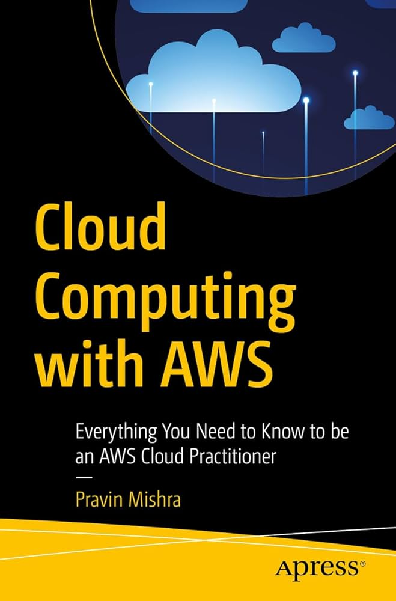
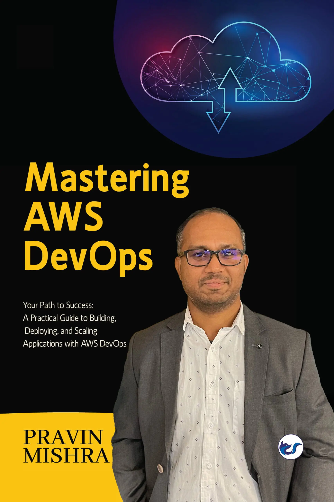
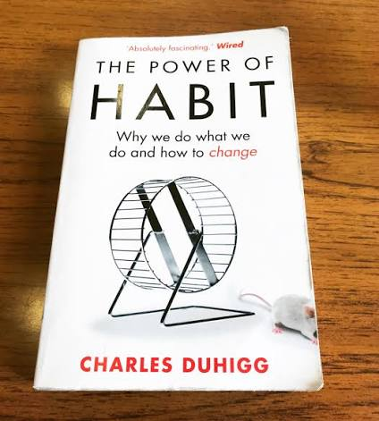
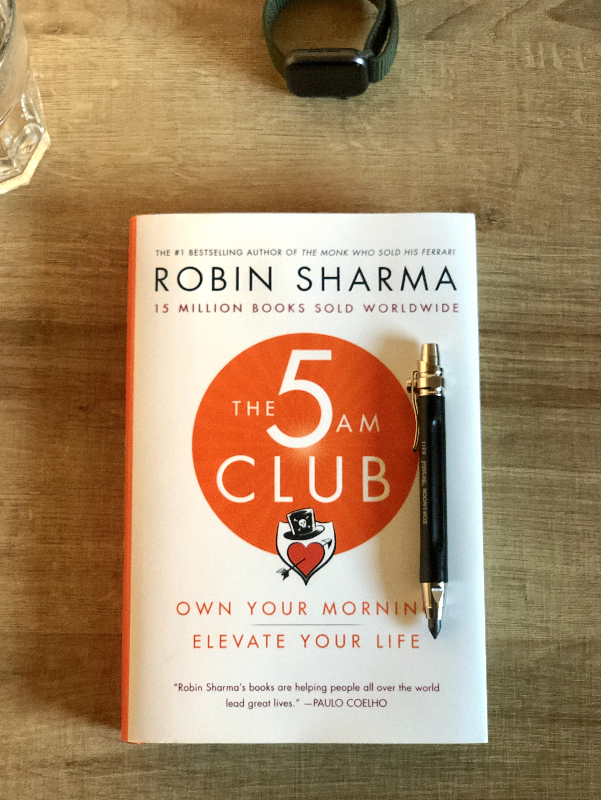
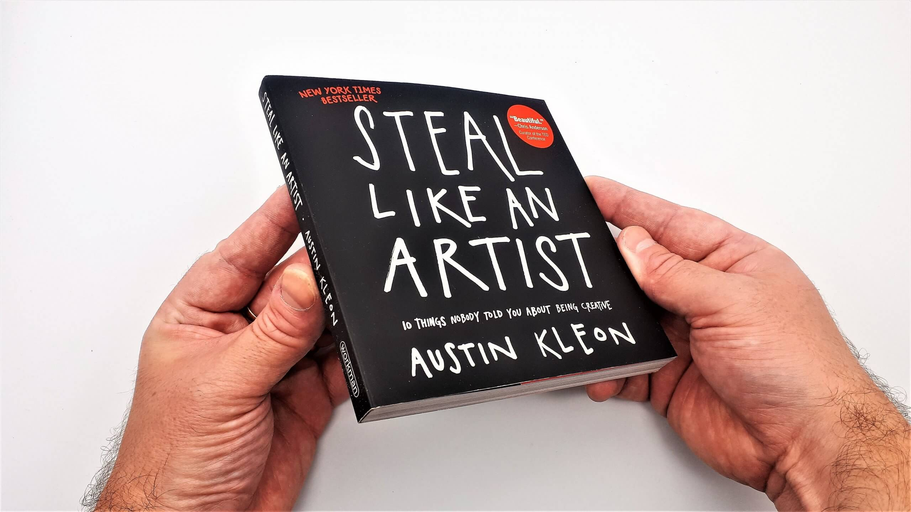
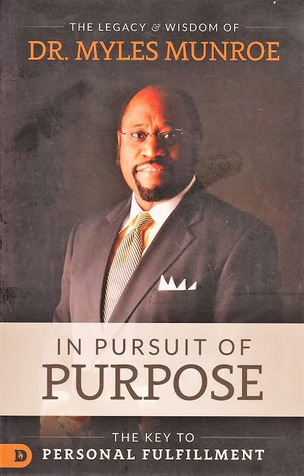
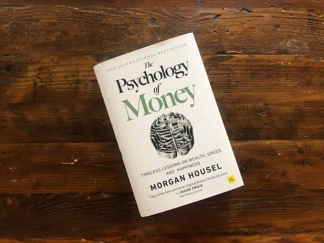
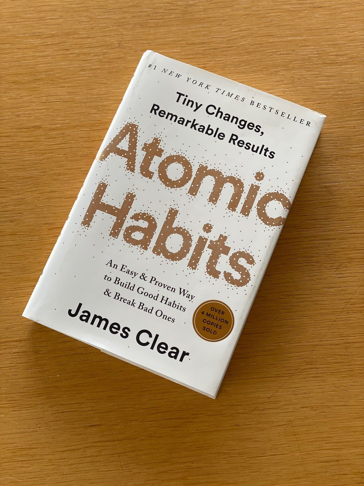
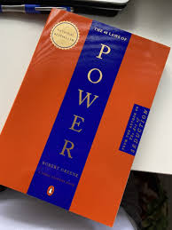

# Week 01 — Success Mindset (Mindset OS)

Part of the DevOps Micro Internship (DMI) Cohort 3 with Agentic AI

---

## Purpose (Read This First)

This week is not motivation homework.

This is you building your **Mindset OS** — the system you will use for the next 5 months (and honestly, for years).

### Expectations

* Be honest.
* Be specific.
* Be practical.
* Write like an adult professional: clear sentences, no one-liners.

You will reuse this in later weeks. So do it properly once.

---

# Assignment 1. What is something you believe to be true that most people around you would disagree with?

### Rules

* No "safe" answers.
* Must be your real belief (not copied from internet).
* Minimum 50 words.

**Hint:** What do you believe about career, money, learning, discipline, relationships, health, success, life, tech industry, etc. that most people don't agree with?

## Answer

One belief I hold that many people around me disagree with is that money does not truly bring fulfillment. While I recognize that money is important and necessary, I don't believe it is the ultimate source of satisfaction in life.At the end of one's life, I believe the greatest satisfaction comes from looking back and knowing that you lived with purpose, made a difference, and stayed true to what mattered most. Money may provide comfort and opportunities, but it cannot provide the deep sense of fulfillment that comes from living a meaningful and purposeful life.

---

# Assignment 2. What are the top 3 objective truths you discovered through experimentation and results?

### Definition

Objective truths do not depend on opinions. They hold true regardless of how people feel.

Write each truth in this format:

**Truth:** (1 sentence)

**Evidence from my life:** (2–4 lines: what you tried + what happened)

---

## Truth #1

### Truth

Consistency produces better results than lots of motivation.

### Evidence from my life

Whenever I followed a structured study schedule and completed my learning consistently, I understood concepts better and made steady progress. Whenever I relied only on motivation, I often procrastinated and fell behind on my goals.

---

## Truth #2

### Truth

Real skills are developed through practice, not by consuming information alone.

### Evidence from my life

I realized that simply watching tutorials or reading documentation did not make me confident in programming. My understanding improved only after I started building projects and applying what I had learned to real-world problems.

---

## Truth #3

### Truth

You cannot achieve a future you do not intentionally prepare for.

### Evidence from my life

As I began planning my weekly routine, setting focus blocks, and creating long-term goals, I gained more clarity about my career path. Before having a plan, I often felt overwhelmed because I didn't know what my next step should be.

---

# Assignment 3. What does your 2.0 version look like?

### Instructions

Write as if a journalist is writing about you **3 to 7 years from now** (not 20 years).

**Minimum 300 words.**

### Rules

* Write in past tense, like it already happened.
* Don't use "likes to / wants to / hopes to."
* Use specifics:

  * built
  * shipped
  * led
  * published
  * earned
  * relocated
  * contributed
* Include skills proof:

  * projects
  * portfolios
  * GitHub
  * blogs
  * certifications
  * job role
  * leadership
  * community contribution
* Add 1–3 images if you can (optional but powerful).

### Publish It Publicly On Any ONE

* LinkedIn
* Medium
* WordPress
* Blogspot
* Personal blog
* Portfolio page

Include this line:

> **P.S. This post is a part of DevOps Micro Internship with Agentic AI Cohort-3 by [Pravin Mishra](https://www.linkedin.com/in/pravin-mishra-aws-trainer/). You can start your DevOps journey by joining this [Discord community](https://discord.pravinmishra.com/) ( https://discord.pravinmishra.com/ ).**

## Your Article

BOYI 2.0 and More upgrades to come.

The Quiet Rise of a DevOps Engineer Who Chose Consistency Over Shortcuts

Five years ago, I didn't have all the answers. I wasn't sure what the future looked like, and I often questioned whether I was on the right path. But instead of waiting for clarity, I made one decision that changed everything—I kept showing up.

I focused on learning software engineering and DevOps, one day at a time. I built projects, documented my work on GitHub, earned industry certifications, and embraced every opportunity to improve. What started as small personal projects gradually became a portfolio that opened doors to a career in DevOps.

Along the way, I learned that success isn't built on motivation. It's built on consistency.

Beyond my day job, I shared what I learned through LinkedIn and Medium, contributed to the tech community, and worked on projects that solved real problems. Every line of code, every late-night study session, and every challenge became part of a much bigger story.

Looking back, I realize that the biggest transformation wasn't becoming a DevOps engineer. It was becoming someone who chose discipline over excuses, growth over comfort, and purpose over shortcuts.

The future I once imagined didn't happen by chance. It was built one intentional day at a time.

**You do not arrive at a future you don't prepare for.**

#DevOps #SoftwareEngineering #CloudComputing #CareerGrowth #ContinuousLearning #BuildInPublic

### Public Link

https://www.linkedin.com/posts/kenneth-boyi-6b4a353a6_boyi-20-and-more-upgrades-to-come-the-share-7478604231239823360-3vAY/?utm_source=share&utm_medium=member_desktop&rcm=ACoAAGN28KgBcLsxZ_9wccn46X5xb7tSMc1PKWE

---

# Assignment 4. Have you ever cut corners (unethical / dishonest / shortcut behavior — not necessarily illegal)? If yes, how did it make you feel?

### Important

You don't need to write the full story.

Focus on the feeling:

* guilt
* fear
* shame
* stress
* regret
* numbness
* etc.

This is about self-awareness, not judgment.

### Answer Format

**Yes / No**

If Yes:

**What emotion did you feel?** (minimum 50–100 words)

## Answer

Yes, I have cut corners before, and it left me feeling ashamed, guilty, and full of regret. I realized that taking shortcuts often leads to consequences that are difficult to undo. The experience taught me that temporary convenience is never worth sacrificing my integrity, and it motivated me to value honesty, discipline, and doing things the right way.

---

# Assignment 5. What are 10 non-fiction books you plan to read in the next 1 year?

### Rules

* Mention **Title + Author**
* Any language allowed
* No fiction novels

### Tip

Choose books that improve:

* mindset
* communication
* productivity
* health
* money
* career
* leadership

## Book List

1. The Bible – The Holy Spirit
2. Cloud Computing with AWS – Pravin Mishra

3. Mastering AWS DevOps – Pravin Mishra

4. The Power of Habit – Charles Duhigg

5. 5am Club – Robin Sharma

6. Steal Like an Artist – Austin Kleon

7. In Pursuit of Purpose – Myles Munroe

8. Psychology of Money – Mogan Housel

9. Atomic Habit – James Clear

10. 48 laws of power - Robert Greene

---

# Assignment 6. What are the things you will measure regularly in your life and career?

### Rules

List topics only. No need to share numbers.

### Must Include

* Learning / skill
* Output / proof
* Health / energy
* Time / focus
* Money / finance (personal or business)

### Example

* Learning hours per week
* Deep work sessions per week
* Projects shipped / documented
* Steps / workouts
* Sleep hours
* Spending tracker

## My Metrics

* Complete one project milestone every week by working 2 hours daily on my personal project.  
* Publish one portfolio project every 2 months. 
* Learn one new programming concept or skill every week and practice it. 
* Save 20% of my monthly income. 
* Invest 10% of my monthly income.
* Walk 7,000 steps every day. 
* Get at least 6 hours of sleep every day.  
* Have one deep-thinking session and a long walk every weekend. 

---

# Assignment 7. Brain Dump + 5-Month System Plan

## Step 1: Brain Dump (Private)

Do a brain dump of everything in your mind into a notebook.

Examples:

* Bills
* Tasks
* Worries
* Goals
* Pending messages
* Ideas
* Responsibilities

### Did You Do It?

**Yes / No**

Answer: Yes

After DMI Course 3, what's next?
I need to build real-life projects for my portfolio. I need to build a strong portfolio. I need to grow my LinkedIn and Instagram accounts.
How is AI affecting what I'm learning right now? What is the future of DevOps, and how do I prepare for it?
What should I invest in? Should I invest in stocks, index funds, or something else? What investment plan should I have? What should I do with my income?
How do I constantly improve myself? What plans should I make for my future?
What problems exist around me, in my community, or in my country? How can I solve them in my own little way?
What idea should I work on? Do I even have an idea worth pursuing?
What do I need to do to become one of the best in my field? How do I make a real impact in the tech industry?
I honestly don't know what my next step should be.

---

## Step 2: Your 5-Month Routine + Focus Blocks

Create a simple plan you can realistically follow for the next 5 months.

### Weekly Routine

Example:

* Mon–Thu: 60 min deep work
* Sat: DMI session
* Sun: Weekly review

#### My Weekly Routine

Mon-Thus: 
- 3 hours of deep work--DMI assignments and learning
- 1 hour of working on personal projects

Fri: 
- Relearning and review of past and currents weeks work

Sat: 
- DMI session/evening review of session 
- deep thinking and long walks in the evening

Sun: Weekly review and planning

Daily Activities:
- 10 minutes of exercise before bathing (Both Morning and Evening) 
- 6 hours of sleep per day
- 1 hours of working on personal project per day 
- 30 minutes of reading a book per day 
- 15 minutes of silence per day

---

### Focus Blocks

#### When Will You Do DMI Work? (Days + Time)

Mon-Fri: 8pm to 11pm WAT
Sat: 5:30am to 1:30pm WAT and evening 9:00pm to 10:30pm WAT
Sun: 8pm to 9pm WAT

#### How Many Sessions Per Week?

6 SESSIONS

### Distraction Rules

Examples:

* Phone rules
* Social media rules
* Environment setup

#### My Distraction Rules

## Distraction Rules

### Phone Rules

- Keep my phone on **Do Not Disturb** during study or work sessions.
- Avoid checking social media until I have completed my planned tasks for the day.
- Place my phone out of reach while working unless it is required.

### Social Media Rules

- Limit social media use to 1 hour 30 minutes per day.
- Do not open social media during work or study hours.

### Environment Setup

- Keep my workspace clean and free of unnecessary items.
- Work in a quiet environment with minimal distractions.
- Close unrelated tabs and applications before starting a task.
- Prepare everything I need before beginning a work session to avoid interruptions.

---

# Reflection – Week 1

### Biggest insight I got about myself this week

I can be consistent and I can be successful

### My biggest weakness/loop I noticed

I hardly measure my progress

### One system I will implement from this week (exact habit + time)

- 10 minutes of exercise before bathing (Both Morning and Evening) 
- 1 deep thinking and long walks every weekend 
- 6 hours of sleep per day
- 1 hours of working on personal project per day 
- 30 minutes of reading a book per day 
- 15 minutes of silence per day

### LinkedIn Post

Paste your LinkedIn post link here:

https://www.linkedin.com/posts/kenneth-boyi-6b4a353a6_join-the-dmi-devops-micro-internship-share-7478234906569973760-pcDc/?utm_source=share&utm_medium=member_desktop&rcm=ACoAAGN28KgBcLsxZ_9wccn46X5xb7tSMc1PKWE

---

## 10. Proof of Work

- LinkedIn Post URL: **https://www.linkedin.com/posts/kenneth-boyi-6b4a353a6_boyi-20-and-more-upgrades-to-come-the-share-7478604231239823360-3vAY/?utm_source=share&utm_medium=member_desktop&rcm=ACoAAGN28KgBcLsxZ_9wccn46X5xb7tSMc1PKWE**  
- Blog / Medium : **https://medium.com/@kennethefeboyi14/boyi-2-0-and-more-upgrades-to-come-5e20a7fc9d11?sharedUserId=kennethefeboyi14**  

---

## 📌 About DMI & CloudAdvisory

DevOps Micro Internship (DMI) is a project-based DevOps program run by Pravin Mishra (The CloudAdvisory) focused on real-world execution, systems thinking, and career readiness.

It helps learners build strong DevOps foundations with hands-on experience.

## 📌 Resources

- 🌐 **DMI Official Website:** https://pravinmishra.com/dmi  
- 🎓 **DevOps for Beginners (Udemy):** https://www.udemy.com/course/devops-for-beginners-docker-k8s-cloud-cicd-4-projects/  
- 🎓 **Ultimate Agentic AI DevOps with Clude Code** https://www.udemy.com/course/ultimate-agentic-ai-devops-with-claude-code/?referralCode=448389767BC96284087B
- 🎓 **DevOps with Claude Code: Terraform, EKS, ArgoCD & Helm** https://www.udemy.com/course/devops-with-claude-code-terraform-eks-argocd-helm/?referralCode=1C5B734505D65A010FA3
- ▶️ **YouTube Playlist (DMI Cohort 3):** https://www.youtube.com/playlist?list=PLFeSNDtI4Cho  
- 🔗 **Pravin Mishra (LinkedIn):** https://www.linkedin.com/in/pravin-mishra-aws-trainer/  
- 🏢 **CloudAdvisory (LinkedIn):** https://www.linkedin.com/company/thecloudadvisory/

---

*This submission is part of DevOps Micro Internship (DMI) Cohort 3 — Agentic AI Track*