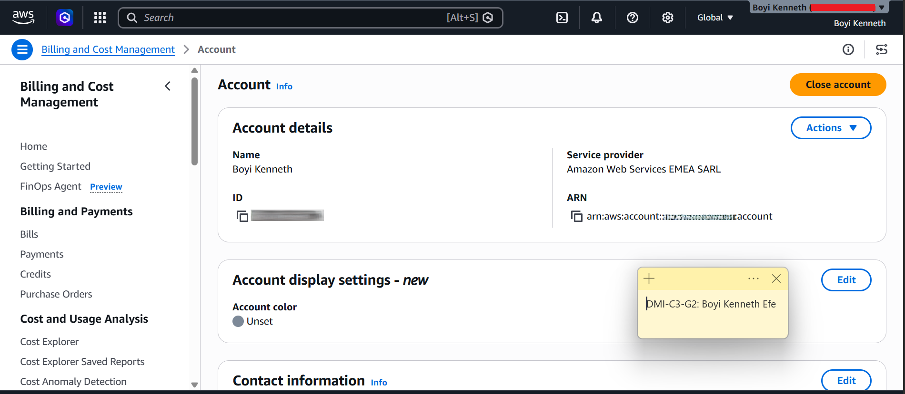

# Assignment 1 — AWS Free Tier Account Setup (EpicReads Cloud Onboarding)

Part of the DevOps Micro Internship (DMI) Cohort 3 with Agentic AI

---

## Purpose

In this assignment, you will create and verify an AWS Free Tier account as part of onboarding EpicReads — an online bookstore moving to the cloud. You will demonstrate an understanding of AWS fundamentals, Free Tier services, and account setup by answering conceptual questions and capturing proof of a working AWS Console login.

---

# Task 1 — Understanding AWS & Free Tier

## Goal

Demonstrate understanding of AWS basics and Free Tier usage by answering the following questions in your own words (3–4 lines each).

### Answers

#### Question 1 — What is an AWS account, and why do you need it at this stage?

An AWS account is an identity that allows an individual or organization to access and manage AWS cloud services such as EC2, S3, and DynamoDB. It also manages resource usage, billing, and account security.

At this stage, an AWS account is important because it gives me practical experience with real cloud infrastructure. Instead of only learning from tutorials, i can create virtual servers, deploy applications, store files, and practice DevOps workflows in a real cloud environment.

---

#### Question 2 — What is AWS Free Tier, and how long does it last?

The AWS Free Tier allows users to use selected AWS services at little or no cost within specific usage limits.

For accounts created after July 15, 2025, AWS offers a new Free Plan with up to $200 in credits: $100 at signup and up to another $100 through guided activities. The plan lasts for up to 6 months or until the credits are used.

Accounts created before July 15, 2025 follow the Legacy Free Tier, which provides selected free services for 12 months.

AWS also provides Always Free services that remain free indefinitely as long as usage stays within the specified limits.

---

#### Question 3 — Name three AWS Free Tier services and their free usage limits.

- Amazon S3: For legacy accounts, up to 5 GB of standard storage, 20,000 GET requests, and 2,000 PUT requests per month.
- Amazon EC2: For legacy accounts, 750 hours per month of eligible t2.micro or t3.micro instances.
- Amazon DynamoDB: An Always Free tier with 25 GB of storage and 25 provisioned read and write capacity units per month.

The EC2 and S3 limits above apply to legacy accounts created before July 15, 2025. Newer accounts use the $200 credit-based Free Plan, while DynamoDB's Always Free tier remains available within its usage limits.

---

# Task 2 — Create AWS Free Tier Account

## Goal

Create a valid AWS Free Tier account and sign in to the AWS Management Console.

> No screenshots required for this task. Completion is verified through Task 3.

---

# Task 3 — Verify AWS Account

## Goal

Confirm that your AWS account setup is complete by navigating to the Account section and capturing proof.

### Evidence

#### Screenshot 1 — AWS Account page showing account name (email may be blurred)

---

# Submission Instructions

- Add all required screenshots in your GitHub repository submission
- Full name must be visible in required screenshots
- Do not expose sensitive information (keys, passwords, account IDs)

---

# Completion Checklist

- [✅] Task 1 answers written in own words
- [✅] AWS Free Tier account created successfully
- [✅] Signed in to AWS Management Console
- [✅] Screenshot of AWS Account page captured (full name visible, no sensitive data)
- [✅] All required screenshots added to repository

---

## 📌 About DMI & CloudAdvisory

DevOps Micro Internship (DMI) is a project-based DevOps program run by Pravin Mishra (The CloudAdvisory) focused on real-world execution, systems thinking, and career readiness.

It helps learners build strong DevOps foundations with hands-on experience.

---

## 📌 Resources

- 🌐 DMI Official Website: https://dmi.pravinmishra.com?utm_source=github&utm_medium=readme  
- 🎓 University: https://university.pravinmishra.com?utm_source=github&utm_medium=readme  
- 💬 Discord Community: https://discord.pravinmishra.com?utm_source=github&utm_medium=readme  
- 📝 Blog: https://dmi.pravinmishra.com/blog?utm_source=github&utm_medium=readme  
- ▶️ YouTube Playlist: https://www.youtube.com/playlist?list=PLFeSNDtI4Cho  
- 🔗 Pravin Mishra (LinkedIn): https://www.linkedin.com/in/pravin-mishra-aws-trainer/  
- 🏢 CloudAdvisory (LinkedIn): https://www.linkedin.com/company/thecloudadvisory/

---

*This submission is part of DevOps Micro Internship (DMI) Cohort 3 — Agentic AI Track.*