# Assignment 3 — Production Maintenance Drill (OPS Checklist)

Part of the DevOps Micro Internship (DMI) Cohort 3 with Agentic AI

---

## Purpose

In this assignment, you will treat your already deployed React application (on Ubuntu VM with Nginx) as a live production system. You will perform structured operational checks covering network validation, service health, log analysis, resource monitoring, configuration verification, and incident simulation with recovery — mirroring real on-call DevOps responsibilities.

---

# Task 1 — Server Access & Networking Validation

## Goal

Verify that the deployed React application is reachable from the browser and confirm basic network connectivity of the Ubuntu VM.

### Evidence

#### Screenshot 1 — Browser showing the React app with your Full Name visible on the UI

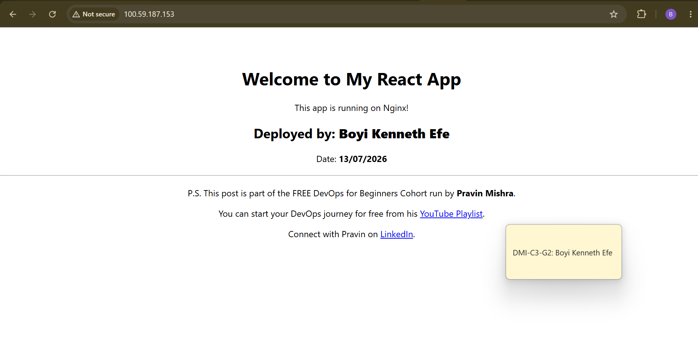

---

#### Screenshot 2 — Output of `ip a`

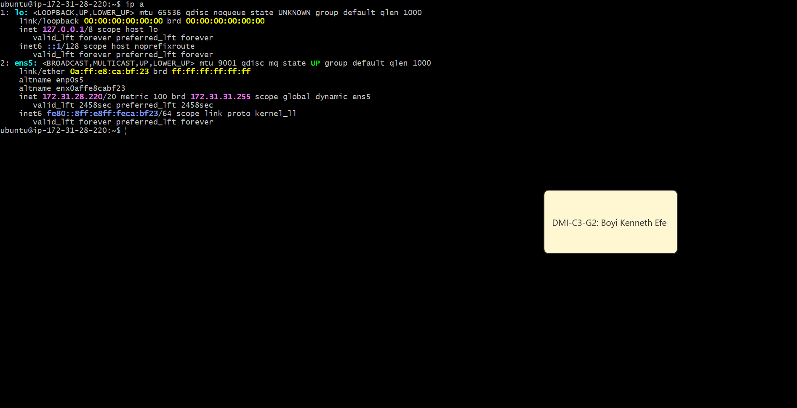

---

#### Screenshot 3 — Output of `sudo ss -tulpen`

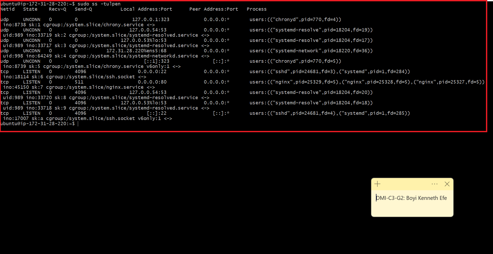

---

#### Screenshot 4 — Output of `sudo ufw status`

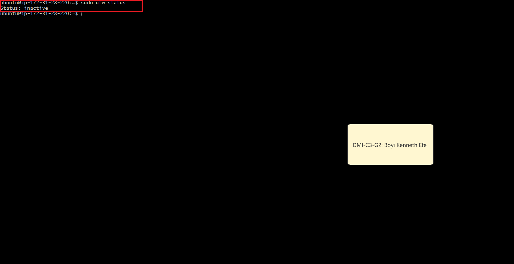

---

### Notes

Answer the following in your own words:

**1. What proves Nginx is listening on 0.0.0.0:80?**

The `sudo ss -tulpen` output shows `tcp LISTEN 0.0.0.0:80` with `nginx` as the process using the port. This confirms that Nginx is listening on port **80** and is bound to **0.0.0.0**, which means it's listening on all network interfaces, not just `localhost`. As a result, it can accept HTTP requests from both the local machine and external devices over the internet.
Here is a screenshot below to show that.

---

**2. What proves SSH is active on port 22?**

The `sudo ss -tulpen` output shows `tcp LISTEN 0.0.0.0:22` with `sshd` as the process, confirming that the SSH service is actively listening on port **22**. Since it's bound to **0.0.0.0**, it accepts connections on all network interfaces, allowing remote access to the server using SSH.
Here is a screenshot below to show that.

---

**3. Did you find any unexpected open ports? Explain briefly.**

No unexpected ports were open. Besides **Nginx** on port **80** and **SSH** on port **22**, the only other listening services were `chronyd` (time synchronization) and `systemd-resolved` (DNS resolution). Both were bound to loopback addresses (`127.0.0.1`, `127.0.0.53`, and `127.0.0.54`), meaning they are only accessible from the server itself and not from external networks. This confirms that only the intended services—Nginx and SSH—are exposed externally.

---

# Task 2 — Service Health & Systemd Validation (Nginx)

## Goal

Verify that Nginx is properly installed, running, enabled at boot, and safely configured.

### Evidence

#### Screenshot 1 — Output of `systemctl status nginx --no-pager`

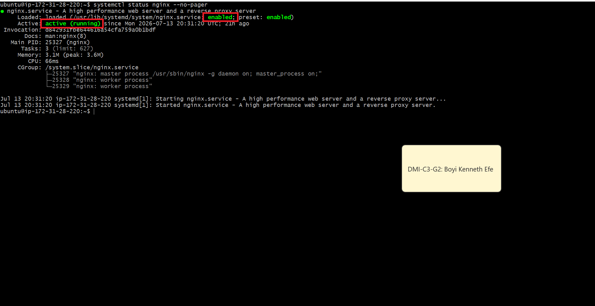

---

#### Screenshot 2 — Output of `sudo nginx -t`

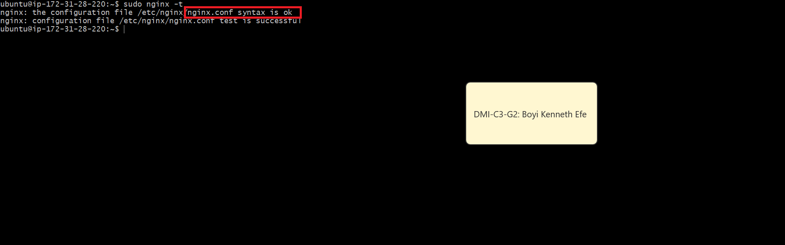

---

#### Screenshot 3 — Output of `sudo ss -lptn '( sport = :80 )'`

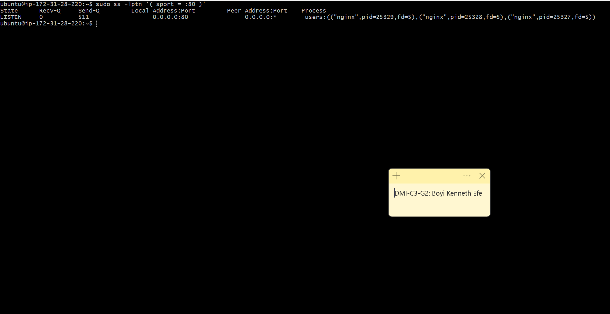

---

### Notes

Answer the following in your own words:

**1. What happens if Nginx fails to restart in production?**

If Nginx fails to restart in a production environment, the website will become unavailable because no service will be listening on port **80** to handle incoming HTTP requests. Users trying to access the site will likely see a connection error.

---

**2. What's your basic rollback plan?**

Before making any configuration changes, I would first run `sudo nginx -t` to verify that the configuration syntax is correct. This helps catch most errors before restarting Nginx. If the restart fails, I would check `systemctl status nginx --no-pager` and `sudo journalctl -u nginx --no-pager -n 50` to identify the exact cause of the failure.

If the issue is caused by an incorrect configuration, I would restore the last known working configuration from a backup or version control, then run `sudo nginx -t` again to confirm the fix before restarting Nginx with `sudo systemctl restart nginx`. I also make it a practice to keep a backup of the working configuration before making changes, so I can quickly roll back if something goes wrong.

---

# Task 3 — Logs & Request Trace

## Goal

Verify real traffic flow and analyze logs to understand system behavior and errors.

### Evidence

#### Screenshot 1 — Output of `sudo tail -n 30 /var/log/nginx/access.log`

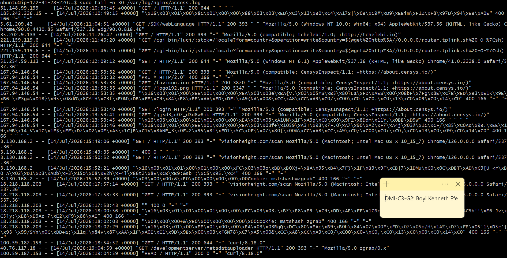

---

#### Screenshot 2 — Output of `sudo tail -n 30 /var/log/nginx/error.log`

---

#### Screenshot 3 — Output of `sudo journalctl -u nginx --no-pager -n 50`

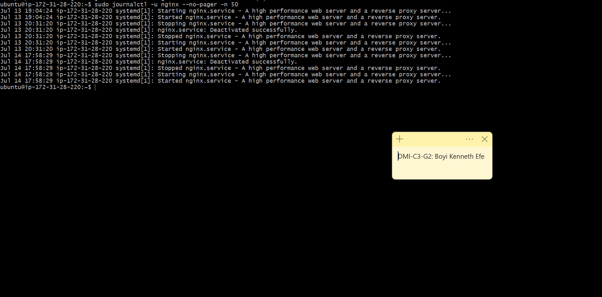

---

### Notes

Answer the following in your own words:

**1. Were there any errors in the logs?**

- If yes, mention 1–2 example error lines from the logs and explain what each one means in simple terms.
- If no, explain what it means if the error log is empty or shows no recent errors during your check.

Write your answer here.

I did not find any errors in either the Nginx error log or the `journalctl` output. The error log returned no entries, while the `journalctl` logs only showed normal events such as **Started**, **Stopped**, **Reloaded**, and **Deactivated successfully**, indicating that Nginx was operating as expected.

---

**2. If there were no errors, what does that indicate about the system?**

An empty error log and a clean `journalctl` history indicate that Nginx has not encountered any internal errors, configuration issues, or failed start, stop, or reload events during the period covered by the logs. This is a good sign that the service is stable and operating as expected. While it doesn't guarantee there are no issues elsewhere in the system, it does show that Nginx itself is healthy based on the available logs.

---

**3. Based on the access logs, were your curl requests visible in the log entries? What does that prove about traffic flow?**

Yes. The curl request appeared in access.log as a GET / request from the server's own public IP with a 200 status and the user agent curl/8.18.0. This confirms the full traffic path is working end-to-end: the request left the client, traveled through the network, reached Nginx, was processed and served correctly, and was logged.

---

# Task 4 — System Resource Health Check (Capacity Red Flags)

## Goal

Assess server capacity and detect potential performance or failure risks.

### Evidence

#### Screenshot 1 — Output of `uptime`

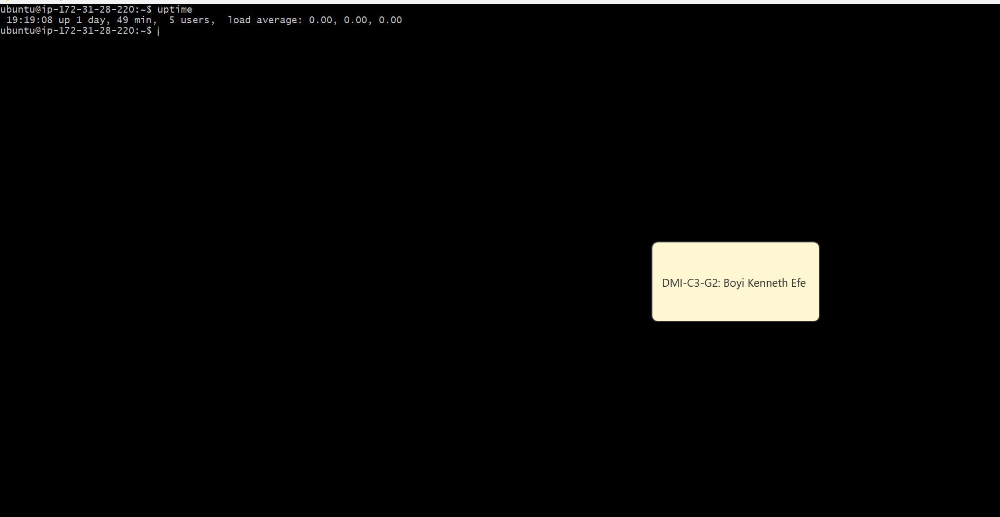

---

#### Screenshot 2 — Output of `free -h`

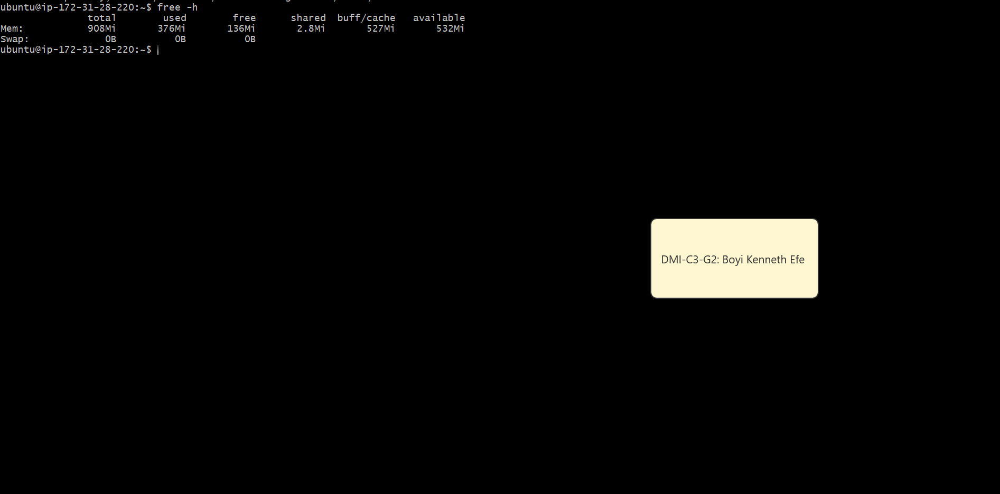

---

#### Screenshot 3 — Output of `df -h`

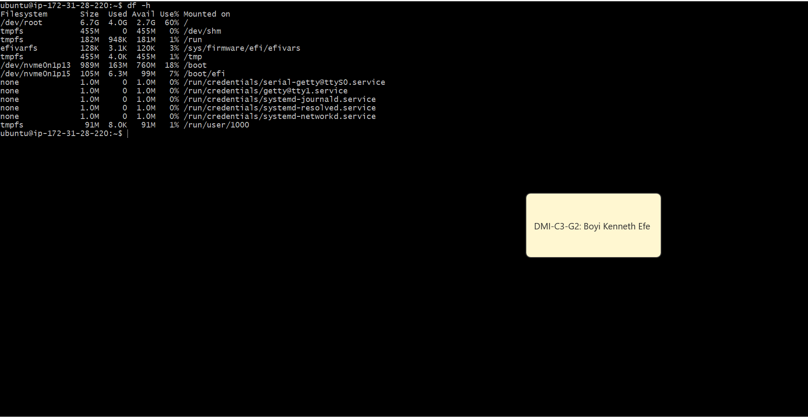

---

#### Screenshot 4 — Output of `sudo du -sh /var/* | sort -h`

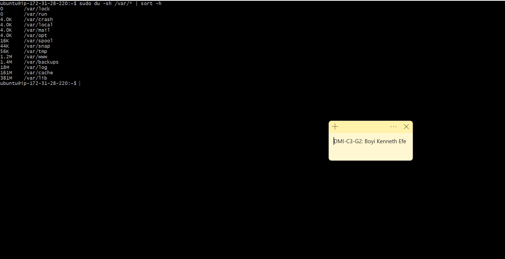 

---

### Notes

Answer the following in your own words:

**1. Which resource looks most critical right now? (CPU/load, memory, or disk) Explain why.**

At the moment, none of the three resources appear to be under critical pressure. CPU usage is low, memory has plenty of available space with no swap usage, and the disk is only **61%** full. If I had to monitor one resource more closely as the server grows, it would be the disk. Disk usage tends to increase gradually over time due to log files, package caches, and application data, and if left unchecked, it can eventually cause serious issues.

---

**2. What happens if disk becomes 100% full in a production server?**

If the disk reaches **100%** capacity, the server can experience serious problems. New log entries may no longer be written, making it much harder to troubleshoot issues during an incident. Applications that need temporary disk space may fail or crash, and package managers or deployment tools may stop working. If the server is running a database, it may refuse new writes or even risk data corruption. In extreme cases, the operating system can become unstable, and I may not even be able to log in through SSH until disk space is freed.

---

# Task 5 — Configuration & Deployment Verification

## Goal

Ensure the correct React build is deployed and Nginx is serving it properly.

### Evidence

#### Screenshot 1 — Output of `ls -lah /var/www/html | head -n 20`

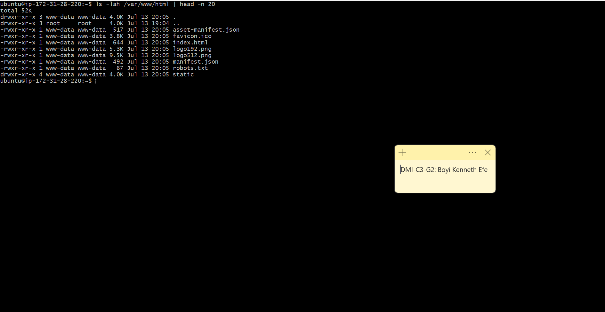  

---

#### Screenshot 2 — Output of `grep -R "Deployed by" -n /var/www/html 2>/dev/null | head`

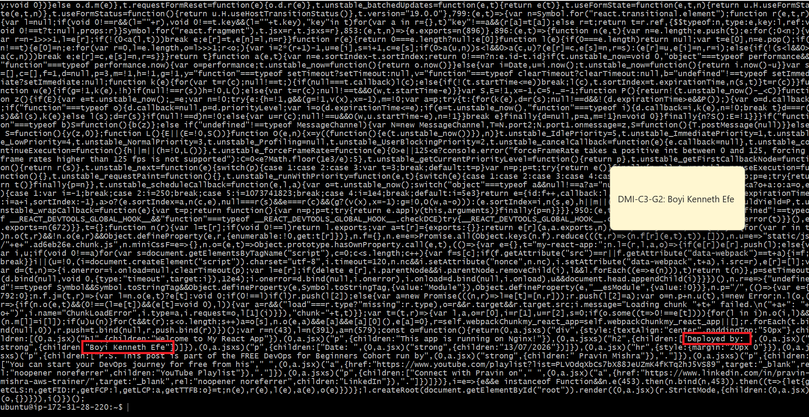

---

#### Screenshot 3 — Output of `grep -n "try_files" /etc/nginx/sites-available/default`

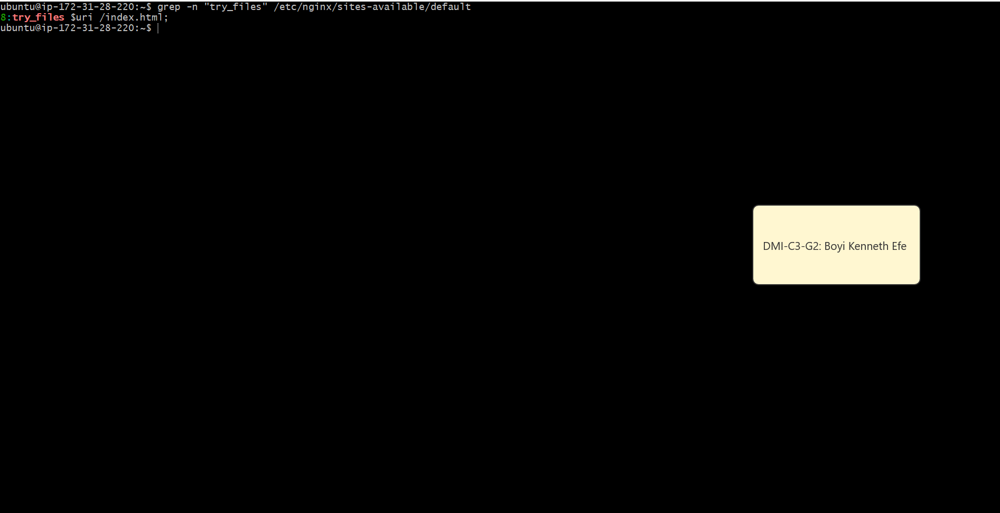

---

### Notes

Answer the following in your own words:

**1. How do you confirm that the correct version of the application is deployed?**

I confirmed that the correct version of the application was deployed by performing several checks. First, I used `ls -lah /var/www/html` to verify that the deployment directory contained a valid Create React App production build, including `index.html`, the `static/` folder with compiled JavaScript and CSS files, and that the files were owned by `www-data`, which is the user Nginx runs as.

Next, I used `grep -R "Deployed by"` to confirm that my custom text was present in the compiled JavaScript bundle, proving that the latest build—not an old or default version—had been deployed. I also checked the Nginx configuration with `grep -n "try_files"` to ensure it falls back to `index.html` for unknown routes, allowing the React single-page application to handle client-side routing correctly.

Finally, I verified the deployment by comparing these checks with the earlier `curl` test, which confirmed that Nginx was serving the same `index.html` file over HTTP. Together, these checks gave me confidence that the correct application version was successfully deployed and accessible to users.

---

# Task 6 — Nginx Configuration Failure Simulation

## Goal

Simulate a real-world Nginx misconfiguration and recover the service safely.

### Evidence

#### Screenshot 1 — Output of `sudo nginx -t` showing the syntax error (broken config)

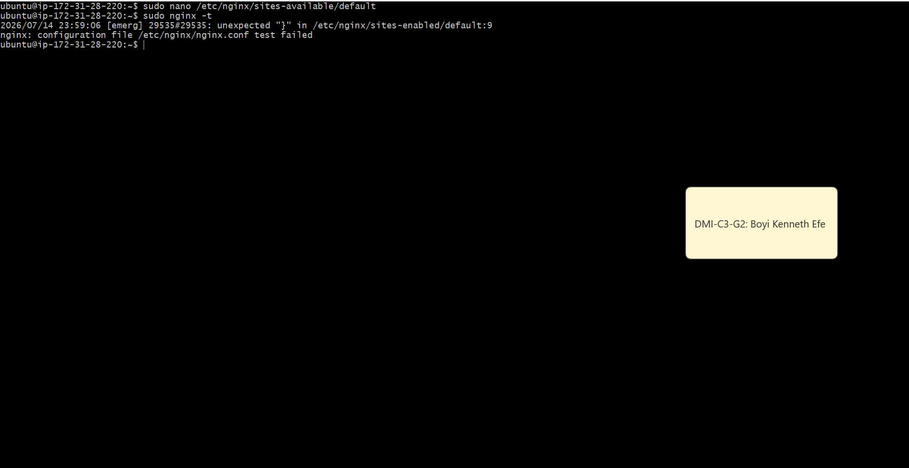

---

#### Screenshot 2 — Output of `sudo nginx -t` showing syntax ok (fixed config)

---

#### Screenshot 3 — Output of `curl -I http://<public-ip>` confirming recovery (200 OK)

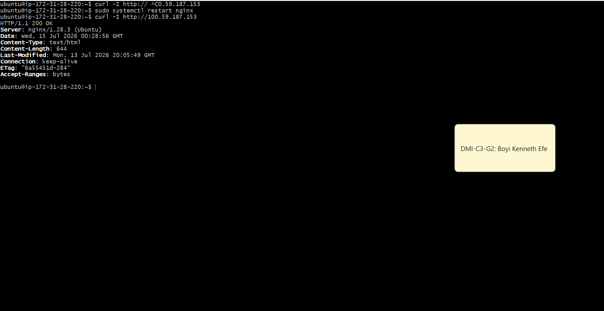

---

### Notes

Answer the following in your own words:

**1. What caused the configuration failure?**

The configuration failed because two semicolons were missing in `/etc/nginx/sites-available/default`. One was intentionally removed from the `try_files $uri /index.html;` directive as part of the task, while the other was missing from the `error_page 404 /index.html;` directive. Since Nginx requires each directive to end with a semicolon, these syntax errors prevented it from parsing the configuration file successfully.

---

**2. How did you fix the issue?**

I reopened the Nginx configuration file and restored the missing semicolons. After making the changes, I ran `sudo nginx -t` to verify that the configuration was valid. Once I received the `syntax is ok` and `test is successful` messages, I restarted Nginx using `sudo systemctl restart nginx`. Finally, I performed a `curl -I` request to confirm that the application was being served correctly and that the service was back online.

---

**3. How can you avoid this kind of issue in real production systems?**

To reduce the risk of configuration errors, I would always run `nginx -t` after making any changes and before restarting or reloading the service. I would also keep Nginx configuration files in Git so I can quickly roll back to a working version if needed. Whenever possible, I would test configuration changes in a staging environment before deploying them to production, and use automated validation in the deployment pipeline so syntax errors are detected before they reach the live server.

---

# Task 7 — Web Application Failure Simulation

## Goal

Simulate missing deployment content and recover the application safely.

### Evidence

#### Screenshot 1 — Output of `curl -I http://<public-ip>` showing failure (non-200 response)

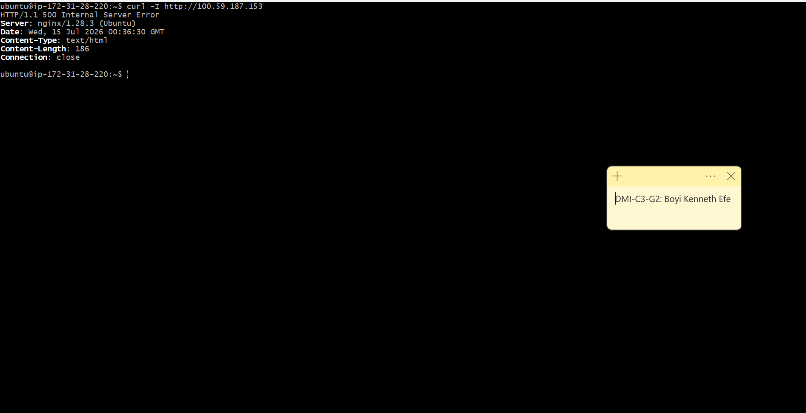

---

#### Screenshot 2 — Output of `curl -I http://<public-ip>` confirming recovery (200 OK)

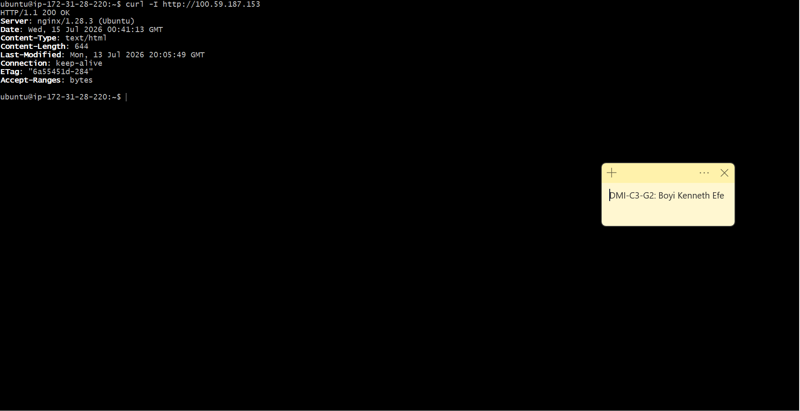

---

### Notes

Answer the following in your own words:

**1. What caused the application to break in this scenario?**

The application stopped working because the web root directory (`/var/www/html`), which Nginx uses to serve the website, was emptied. Although Nginx was still running and its configuration was correct, there were no application files available to serve. Without the required files, including the React application's `index.html`, Nginx returned a **500 Internal Server Error** instead of loading the website.

---

**2. How did you fix the issue and restore the application?**

I restored the application by moving the backed-up deployment (html_backup) back to its original location at /var/www/html. Since the backup contained the complete production build, I was able to recover the application without rebuilding it. After restoring the files, I restarted Nginx and verified that the website was working by running curl -I, which returned a 200 OK response. I also confirmed that the Content-Length, Last-Modified, and ETag values matched the pre-incident state, proving that the original build had been fully restored.

---

**3. What steps would you take to prevent this kind of issue in real production systems?**

To prevent this type of issue, I would always create an automated backup before deploying a new version so I can quickly roll back if needed. Rather than replacing files directly in the live directory, I would deploy each release to a separate versioned directory and switch a symbolic link (such as /var/www/current) to the new release only after verifying it is complete. I would also include deployment checks in the CI/CD pipeline to confirm that essential files like index.html exist before marking the deployment as successful. Finally, I would use post-deployment health checks and monitoring to verify that the application is returning a healthy 200 OK response immediately after every deployment, allowing any issues to be detected and resolved quickly.

---

# Task 8 — Security & Reliability Review

## Goal

Review and reflect on the security and reliability practices applied during this assignment.

### Security & Reliability Notes

Answer the following in your own words:

**1. Why is SSH key-based authentication more secure than sharing passwords?**

SSH key-based authentication is more secure because it uses a pair of encrypted keys instead of a password that can be guessed or stolen. The private key stays on my local machine and is never sent to the server, while the server uses the matching public key to verify my identity. This makes SSH connections much more resistant to force attacks and password theft, while also allowing me to log in securely without exposing sensitive credentials.

---

**2. Why should only required ports be open on a production server?**

Only the ports required for the server's intended services should be open because every open port increases the server's attack surface. Unnecessary open ports can expose unused or vulnerable services that attackers may exploit. By allowing only the required ports—such as **22** for SSH and **80** or **443** for web traffic—I reduce security risks, make the server easier to manage, and follow the principle of least exposure.

---

**3. Why is it important for Nginx to be enabled on boot?**

Enabling Nginx to start on boot ensures that the web server automatically comes back online whenever the server is restarted or recovers from a power outage. Without this, I would have to start Nginx manually after every reboot, causing unnecessary downtime and making the website unavailable until the service is started.

---

**4. What are the risks of sharing secrets, keys, or credentials publicly?**

Sharing secrets, keys, or credentials publicly can give unauthorized users access to servers, applications, or cloud resources. This can lead to data breaches, unauthorized changes, service disruptions, or unexpected costs if the resources are misused. To reduce these risks, I keep sensitive information private, store it securely, and never commit it to public repositories or share it in screenshots or documentation.

---

**5. Why should cloud resources be stopped or terminated when they are no longer needed?**

Cloud resources should be stopped or terminated when they are no longer needed to avoid unnecessary costs, since many cloud services are billed based on usage. Removing unused resources also reduces the attack surface, keeps the environment organized, and makes it easier to manage only the infrastructure that is actively in use.

---

# LinkedIn Post (Required)

## Evidence

#### LinkedIn Post URL

Paste your LinkedIn post URL here:

`https://lnkd.in/p/erCSmbCB`

---

#### Screenshot — Published LinkedIn post

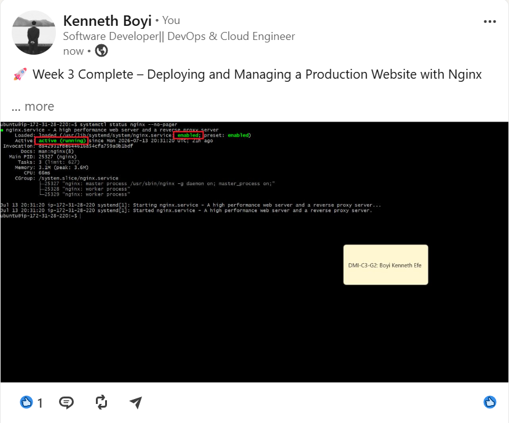

---

# Submission Instructions

- Add all required screenshots in your submission
- Full name must be visible in required screenshots
- Do not expose sensitive information (keys, passwords, account IDs)

---

# Completion Checklist

- [✅] Task 1: Screenshots (browser, ip a, ss -tulpen, ufw status) + Notes answered
- [✅] Task 2: Screenshots (nginx status, nginx -t, ss port 80) + Notes answered
- [✅] Task 3: Screenshots (access log, error log, journalctl) + Notes answered
- [✅] Task 4: Screenshots (uptime, free -h, df -h, du -sh) + Notes answered
- [✅] Task 5: Screenshots (ls html, grep deployed by, grep try_files) + Notes answered
- [✅] Task 6: Screenshots (nginx -t fail, nginx -t pass, curl recovery) + Notes answered
- [✅] Task 7: Screenshots (curl failure, curl recovery) + Notes answered
- [✅] Task 8: Security & Reliability Notes answered
- [✅] LinkedIn post published and URL submitted
- [✅] Full Name visible in all required screenshots
- [✅] No sensitive data exposed

---

## 📌 About DMI & CloudAdvisory

DevOps Micro Internship (DMI) is a project-based DevOps program run by Pravin Mishra (The CloudAdvisory) focused on real-world execution, systems thinking, and career readiness.

It helps learners build strong DevOps foundations with hands-on experience.

---

## 📌 Resources

- 🌐 DMI Official Website: https://dmi.pravinmishra.com?utm_source=github&utm_medium=readme  
- 🎓 University: https://university.pravinmishra.com?utm_source=github&utm_medium=readme  
- 💬 Discord Community: https://discord.pravinmishra.com?utm_source=github&utm_medium=readme  
- 📝 Blog: https://dmi.pravinmishra.com/blog?utm_source=github&utm_medium=readme  
- ▶️ YouTube Playlist: https://www.youtube.com/playlist?list=PLFeSNDtI4Cho  
- 🔗 Pravin Mishra (LinkedIn): https://www.linkedin.com/in/pravin-mishra-aws-trainer/  
- 🏢 CloudAdvisory (LinkedIn): https://www.linkedin.com/company/thecloudadvisory/

---

*This submission is part of DevOps Micro Internship (DMI) Cohort 3 — Agentic AI Track.*