# Assignment 5 — Bash Script Automation Drill (OPS Checklist)

Part of the DevOps Micro Internship (DMI) Cohort 3 with Agentic AI

---

## Purpose

In this assignment, you will practice Bash scripting by building a series of small automation scripts covering environment setup, variables, arrays, loops, file conditionals, if-else logic, and functions. These scripts form the foundation of real-world Linux automation used in DevOps, cloud, and production support environments.

---

# Task 1 — Bash Environment & Workspace Setup

## Goal

Verify that Bash is available on your system and create a clean workspace for this assignment.

### Evidence

#### Screenshot 1 — Output of `echo $SHELL` and `bash --version`

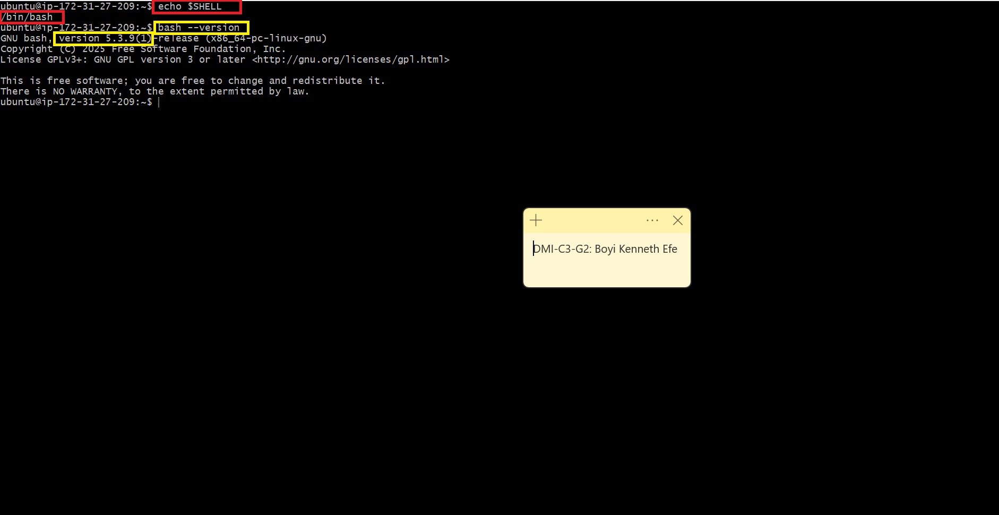

---

#### Screenshot 2 — Output of `pwd` and `ls -lah` showing the scripts directory

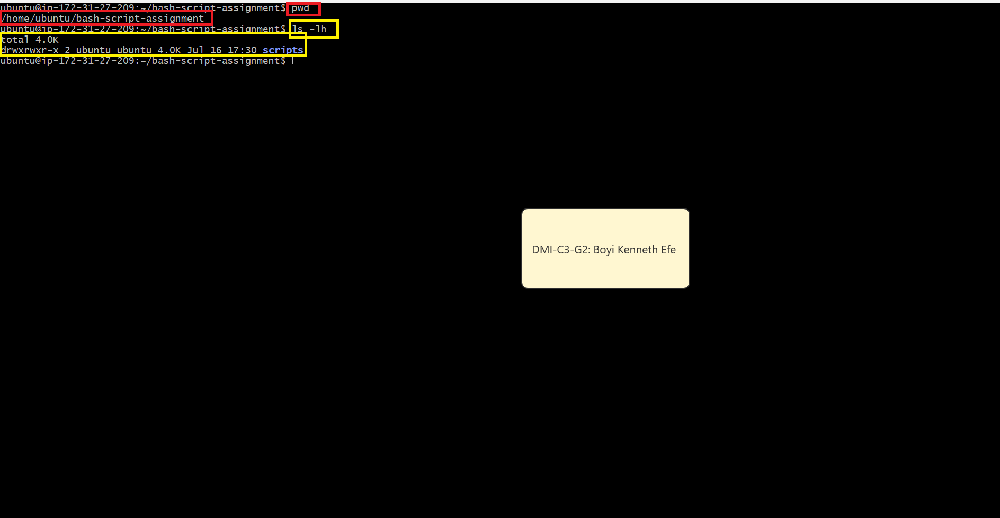

---

### Notes

Answer the following in your own words:

**1. What is Bash?**

Bash stands for Bourne Again Shell.Bash is a command-line shell that lets you interact with an operating system by typing commands instead of using a graphical interface.Bash is commonly used on Linux servers to manage files, run programs, and automate tasks.

---

**2. What is the difference between shell and Bash?**

A shell is a program that allows you to interact with an operating system by typing commands, while Bash is one specific type of shell; other examples include Zsh, Fish, KornShell (ksh), and PowerShell.Different shells perform similar core tasks, but they may have different syntax, features, configuration files, and scripting capabilities. 

---

**3. Why is it important to confirm the Bash version before writing scripts?**

It is important to confirm the Bash version to verify that Bash is installed and available on the system, and to know which version I am working with before writing scripts that may depend on specific Bash features.

---

# Task 2 — Your First Bash Script

## Goal

Create your first Bash script, make it executable, and run it from the terminal.

### Evidence

#### Screenshot 1 — Content of `first-script.sh`

---

#### Screenshot 2 — Output of `./first-script.sh`

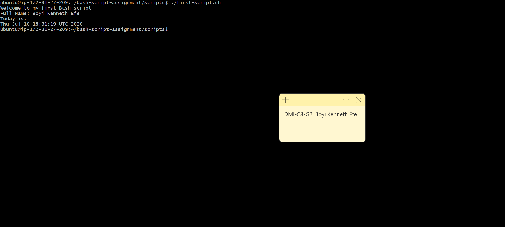

---

#### Screenshot 3 — Output of `ls -l first-script.sh` showing executable permission

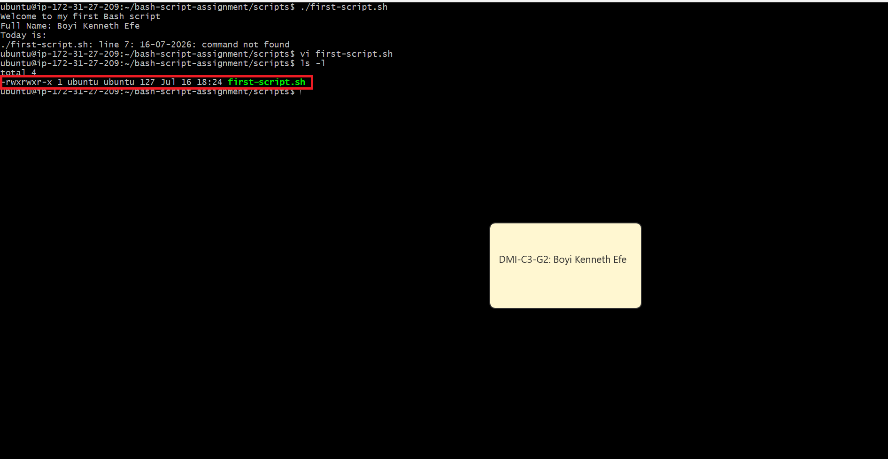

---

### Notes

Answer the following in your own words:

**1. What is the purpose of `#!/bin/bash`?**

#!/bin/bash is called a shebang. It tells the operating system to run a script using the Bash shell.

---

**2. Why do we use `chmod +x` before running a script?**

We use chmod +x to add execute permission to a script. Without this permission, the operating system may not allow me to run the script directly.

---

**3. What is the difference between running a script using `./script.sh` and `bash script.sh`?**

The main difference is how the script is executed:

`./script.sh` runs the script as an executable file. It requires execute permission `(chmod +x script.sh)` and uses the interpreter specified in the shebang, such as #!/bin/bash.

`bash script.sh` directly tells Bash to run the script, so the script does not need execute permission. The shebang is also not required for Bash to run it.

---

# Task 3 — Variables: User Information Script

## Goal

Use variables to store and display user-related information.

### Evidence

#### Screenshot 1 — Content of `user-info.sh`

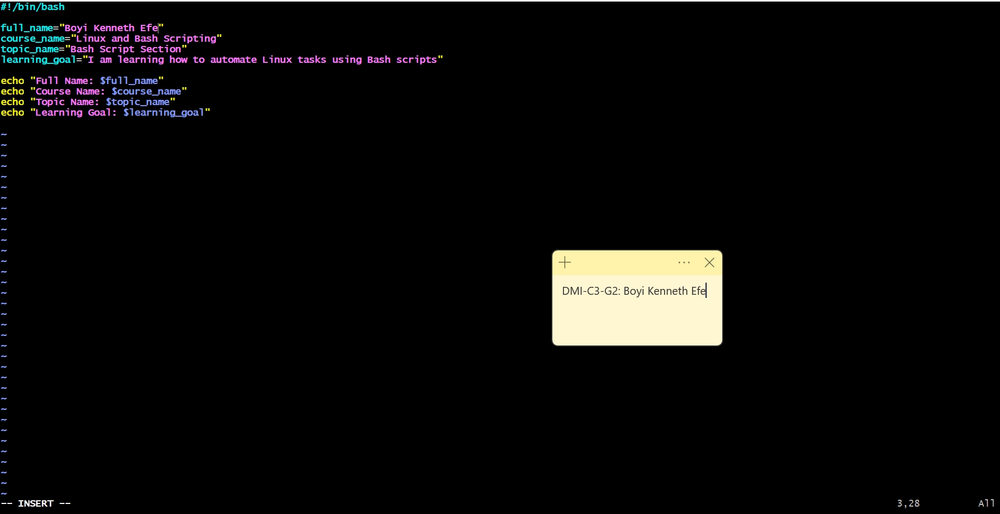

---

#### Screenshot 2 — Output of `./user-info.sh`

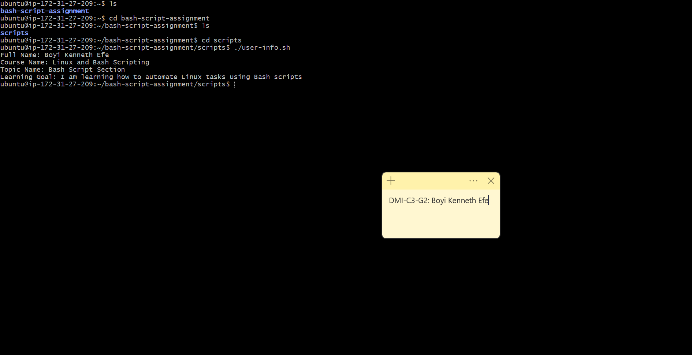

---

### Notes

Answer the following in your own words:

**1. What is a variable in Bash?**

A variable in Bash is a named container used to store data, such as text or numbers, so you can use that value later in your script.e.g
name="Kenneth"
echo "$name"

name here is a variable

---

**2. Why should we avoid spaces around the `=` sign when creating variables?**

We avoid spaces around the = sign because Bash treats variable assignments as a single command with this format:

name="Kenneth"

If you add spaces:

name = "Kenneth"

Bash interprets name as a command and = as an argument, which causes an error.

---

**3. How do you access the value stored inside a Bash variable?**

You access the value stored in a Bash variable by placing a $ before the variable name.

name="Kenneth"
echo "$name"

Here, $name retrieves the value stored in the name variable, so the output will be:

Kenneth

---

# Task 4 — Arrays & Loops: Tools Checklist Script

## Goal

Use arrays and loops to print a checklist of tools used in Bash scripting.

### Evidence

#### Screenshot 1 — Content of `tools-checklist.sh`

---

#### Screenshot 2 — Output of `./tools-checklist.sh`

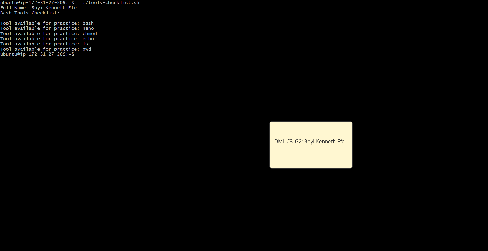

---

### Notes

Answer the following in your own words:

**1. What is an array in Bash?**

An array is used to store multiple values under one variable name. In this script, the tools array stores several Linux and Bash tools.
Example:
tools=("bash" "nano" "chmod" "echo" "ls" "pwd")

---

**2. Why are arrays useful in scripts?**

Arrays help us to keep related values together. Instead of creating a separate variable for every tool, we can store all the tools in one array and process them using a loop. This makes the script shorter and easier to update access

---

**3. What does `"${tools[@]}"` mean?**

"${tools[@]}" expands to all the individual values stored in the tools array. The for loop uses it to access each tool one at a time. The double quotes are important because they keep each array item as a separate value, even if an item contains spaces.

---

**4. What is the purpose of the `for` loop in this script?**

The for loop goes through every item in the tools array one by one. During each iteration, the current item is temporarily stored in the tool variable, which can then be used inside the loop—for example, to print each tool in the terminal.

---

# Task 5 — Loops: Number Counter Script

## Goal

Use loops to repeat a task multiple times.

### Evidence

#### Screenshot 1 — Content of `counter.sh`

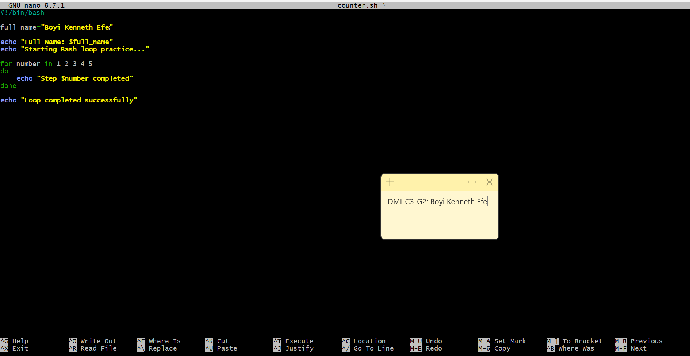

---

#### Screenshot 2 — Output of `./counter.sh`

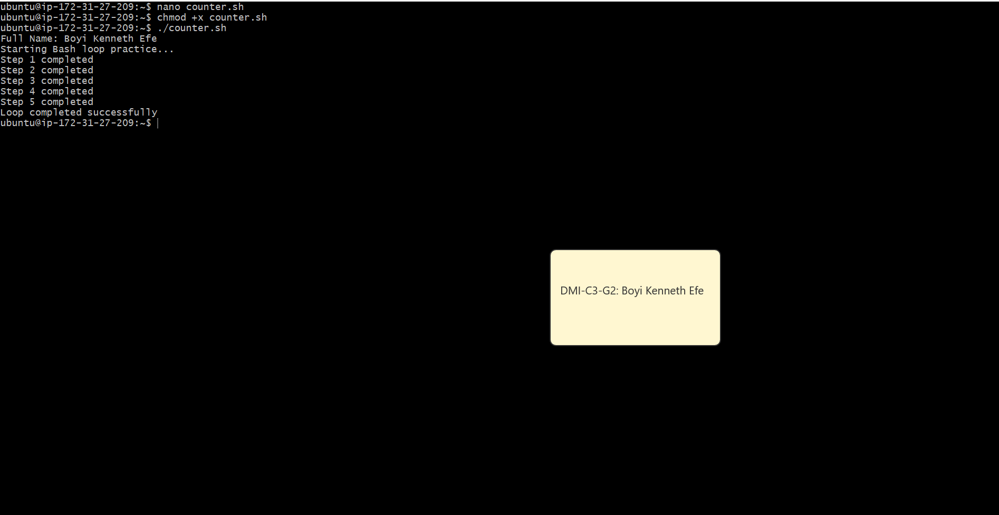

---

### Notes

Answer the following in your own words:

**1. What is a loop?**

A loop is a way to repeat the same task multiple times. Instead of writing the same command repeatedly, I can place it inside a loop and let Bash run it as many times as needed.

---

**2. Why do we use loops in Bash scripting?**

We use loops to automate repetitive tasks. They help make scripts shorter, reduce duplicated code, and save time when performing the same operation on multiple values or items.

---

**3. How many times did the loop run in your script?**

The loop ran five times because it was given five values

---

**4. What would you change if you wanted the loop to run 10 times?**

I would add the numbers 6 through 10 to the list, so the loop has ten values to process

---

# Task 6 — Files & Conditionals: File Validation Script

## Goal

Use file checks and conditionals to verify whether files and directories exist.

### Evidence

#### Screenshot 1 — Output of `ls -lah ../test-folder`

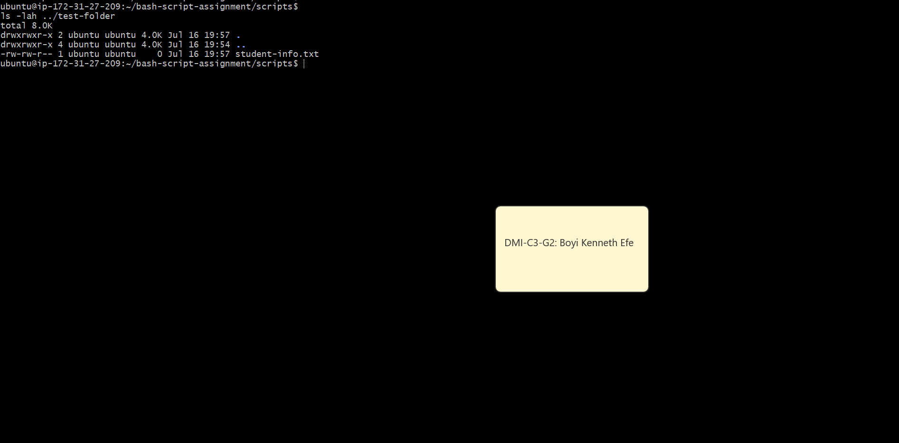

---

#### Screenshot 2 — Content of `file-check.sh`

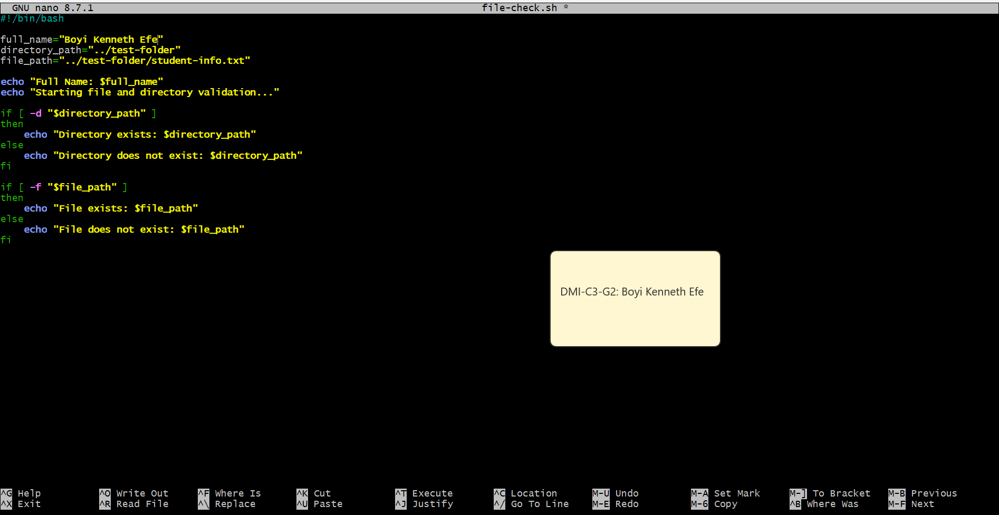

---

#### Screenshot 3 — Output of `./file-check.sh`

---

### Notes

Answer the following in your own words:

**1. What does `-d` check in Bash?**

The -d test checks whether a given path exists and points to a directory. If the directory exists, the condition returns true.

---

**2. What does `-f` check in Bash?**

The -f test checks whether a given path exists and points to a regular file. If the file exists, the condition returns true.

---

**3. Why should file and directory paths be stored in variables?**

Storing paths in variables makes scripts easier to read, maintain, and update. If a path changes, I only need to update the variable once instead of changing the same path in multiple places.

---

**4. What happens if the file does not exist?**

If the file does not exist, the -f test returns false. The script then executes the commands inside the else block and displays

---

# Task 7 — Conditionals: Pass or Retry Script

## Goal

Use if-else conditionals to make decisions based on a variable value.

### Evidence

#### Screenshot 1 — Content of `score-check.sh` with `score=85`

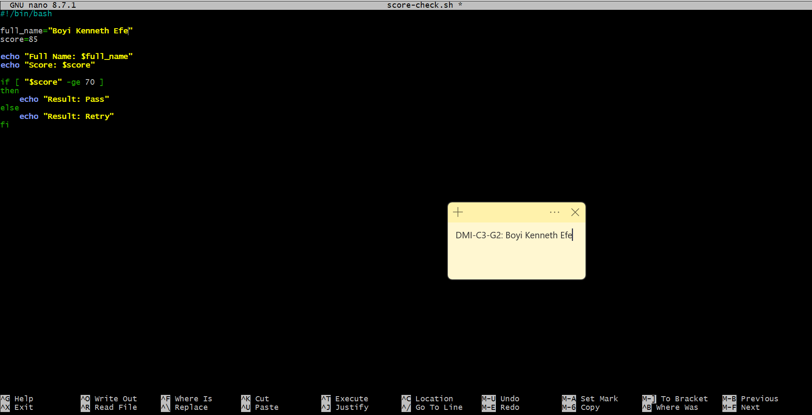

---

#### Screenshot 2 — Output showing `Result: Pass`

---

#### Screenshot 3 — Content of `score-check.sh` with `score=55`

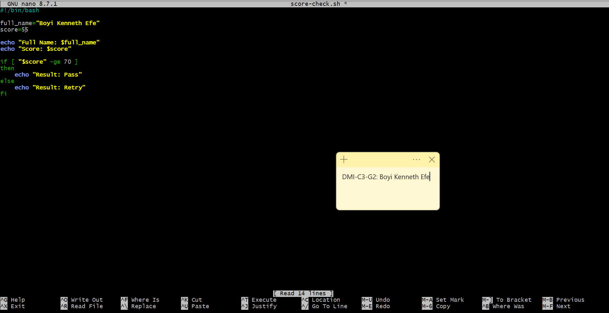

---

#### Screenshot 4 — Output showing `Result: Retry`

---

### Notes

Answer the following in your own words:

**1. What is the purpose of if-else in Bash?**

An if-else statement allows a script to make decisions based on a condition. If the condition is true, the commands inside if run. If the condition is false, the commands inside else run instead.

---

**2. What does `-ge` mean?**

-ge means greater than or equal to. In this example:

[ "$score" -ge 70 ]

Bash checks whether the value of score is 70 or higher

---

**3. Why should conditions be tested with different values?**

I should test conditions with different values to make sure the script handles different possible outcomes correctly. For example, 85 can test the Pass result, while 55 can test the Retry result. I should also test the boundary value, 70, because it is the exact point where the condition should still return Pass.

---

**4. How can conditionals help in automation scripts?**

Conditionals allow automation scripts to make decisions based on the current state of the system. For example, a script can check whether a service is running, a file exists, or disk space is getting low, and then take the appropriate action based on the result.

---

# Task 8 — Functions: Final Bash Automation Script

## Goal

Create a final Bash script using functions to organize reusable code.

### Evidence

#### Screenshot 1 — Content of `final-automation.sh`

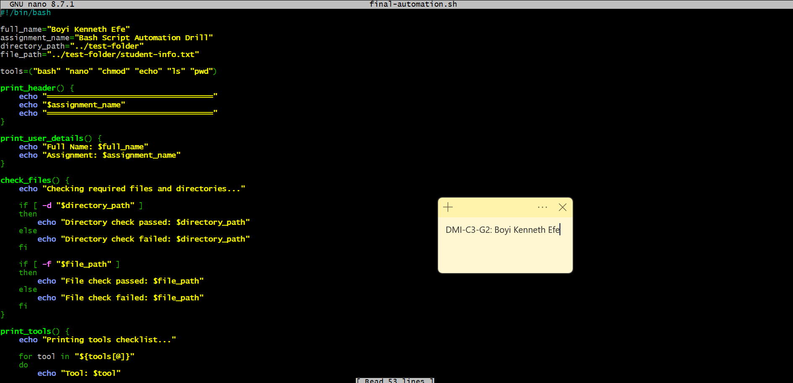

---

#### Screenshot 2 — Output of `./final-automation.sh`

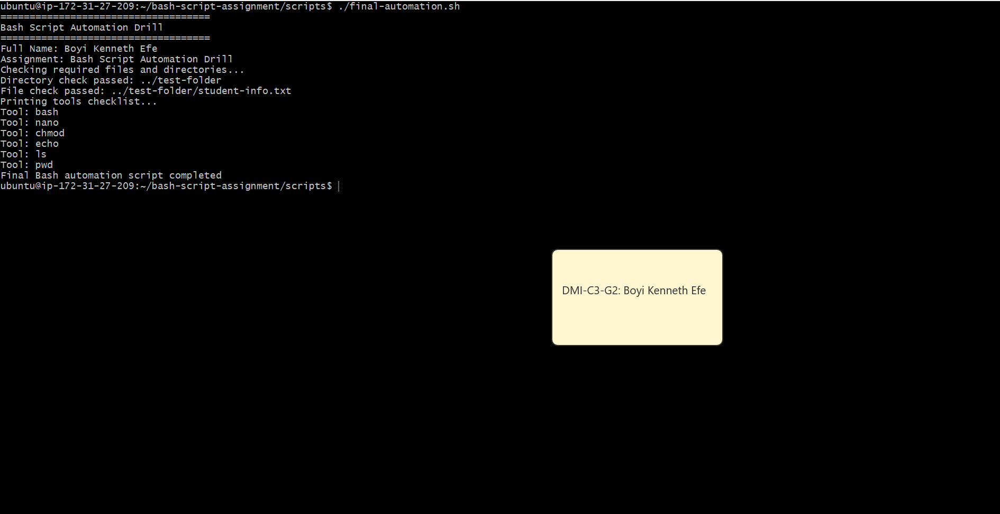

---

#### Screenshot 3 — Output of `ls -lah` showing all created scripts

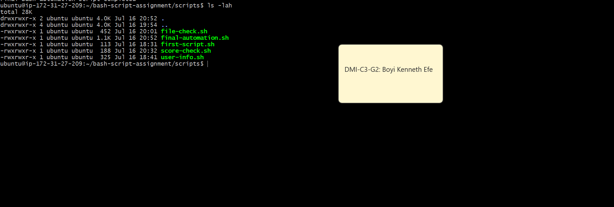

---

### Notes

Answer the following in your own words:

**1. What is a function in Bash?**

A function is a named group of commands created to perform a specific task. Once I define a function, I can run all the commands inside it by calling the function's name.

---

**2. Why are functions useful in scripts?**

Functions help me break a large script into smaller, organized sections. This makes the script easier to read, maintain, and troubleshoot. If I need to perform the same task more than once, I can simply call the function again instead of rewriting the same commands.

---

**3. Which functions did you create in this script?**

I created four functions:

print_header — prints the assignment header.
print_user_details — prints my full name and the assignment name.
check_files — checks whether the required directory and file exist.
print_tools — uses a loop to print each tool stored in the array.

---

**4. How does this final script combine variables, arrays, loops, conditionals, files, and functions?**

The script uses variables to store my name, the assignment name, and the required file paths. It uses an array to store the tool names and a loop to print them one by one.

It also uses if-else conditionals with -d and -f to check whether the required directory and file exist. Finally, the related commands are organized into functions, which are called in the correct order to run the complete automation script.

---

# LinkedIn Post (Required)

## Evidence

#### LinkedIn Post URL

Paste your LinkedIn post URL here:

`https://www.linkedin.com/posts/kenneth-boyi-6b4a353a6_devops-linux-bash-ugcPost-7483643752071294977-09VK/?utm_source=share&utm_medium=member_desktop&rcm=ACoAAGN28KgBcLsxZ_9wccn46X5xb7tSMc1PKWE`

---

#### Screenshot — Published LinkedIn post

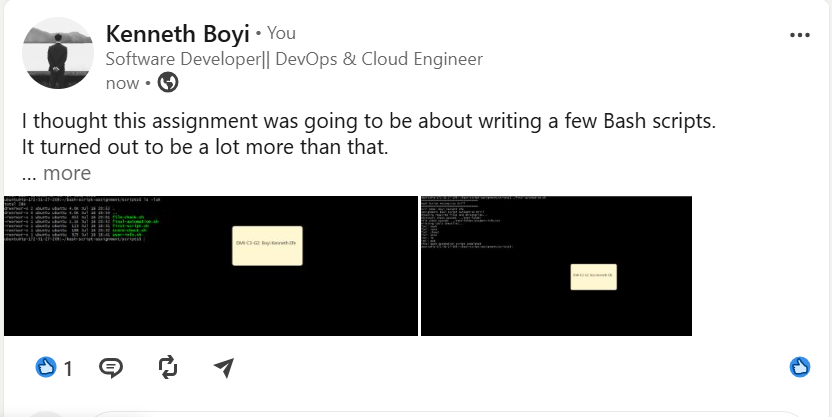

---

# Submission Instructions

- Add all required screenshots in your submission
- Full name must be visible in required screenshots
- All script files must be created and run successfully
- Required notes must be answered clearly for every task
- Do not expose sensitive information (keys, passwords, credentials)

---

# Completion Checklist

- [✅] Task 1: Environment setup verified, workspace created (Screenshots 1–2, Notes answered)
- [✅] Task 2: First script created, executed, permissions verified (Screenshots 1–3, Notes answered)
- [✅] Task 3: Variables script created and run (Screenshots 1–2, Notes answered)
- [✅] Task 4: Arrays and loops script created and run (Screenshots 1–2, Notes answered)
- [✅] Task 5: Counter loop script created and run (Screenshots 1–2, Notes answered)
- [✅] Task 6: File validation script created and run (Screenshots 1–3, Notes answered)
- [✅] Task 7: Pass/Retry conditional script tested with both values (Screenshots 1–4, Notes answered)
- [✅] Task 8: Final automation script created and run (Screenshots 1–3, Notes answered)
- [✅] All scripts run without errors
- [✅] Full Name visible in all required screenshots
- [✅] LinkedIn post published and URL submitted
- [✅] No sensitive data exposed

---

## 📌 About DMI & CloudAdvisory

DevOps Micro Internship (DMI) is a project-based DevOps program run by Pravin Mishra (The CloudAdvisory) focused on real-world execution, systems thinking, and career readiness.

It helps learners build strong DevOps foundations with hands-on experience.

---

## 📌 Resources

- 🌐 DMI Official Website: https://dmi.pravinmishra.com?utm_source=github&utm_medium=readme  
- 🎓 University: https://university.pravinmishra.com?utm_source=github&utm_medium=readme  
- 💬 Discord Community: https://discord.pravinmishra.com?utm_source=github&utm_medium=readme  
- 📝 Blog: https://dmi.pravinmishra.com/blog?utm_source=github&utm_medium=readme  
- ▶️ YouTube Playlist: https://www.youtube.com/playlist?list=PLFeSNDtI4Cho  
- 🔗 Pravin Mishra (LinkedIn): https://www.linkedin.com/in/pravin-mishra-aws-trainer/  
- 🏢 CloudAdvisory (LinkedIn): https://www.linkedin.com/company/thecloudadvisory/

---

*This submission is part of DevOps Micro Internship (DMI) Cohort 3 — Agentic AI Track.*