# Assignment 6 — Build an AI-Assisted Linux Health Check (AI-Assisted Linux Incident Triage)

Part of the DevOps Micro Internship (DMI) Cohort 3 with Agentic AI

---

## Purpose

In this assignment, you will build a read-only Bash triage script that checks the health of your Ubuntu server and Nginx application, connect it to Claude Code as a reusable `/linux-triage` skill, simulate a controlled Nginx incident, use the skill to gather and analyze evidence, recover the service manually, and verify recovery. The workflow follows the Agentic Loop: Gather → Analyze → Human Act → Verify.

---

# Task 1 — Confirm the Healthy Baseline and Create the Workspace

## Goal

Confirm that Nginx and the React application are healthy before building the automation.

### Evidence

#### Screenshot 1 — Output of `systemctl is-active nginx`, `ss -ltn | grep ':80'`, and `curl -I http://localhost`

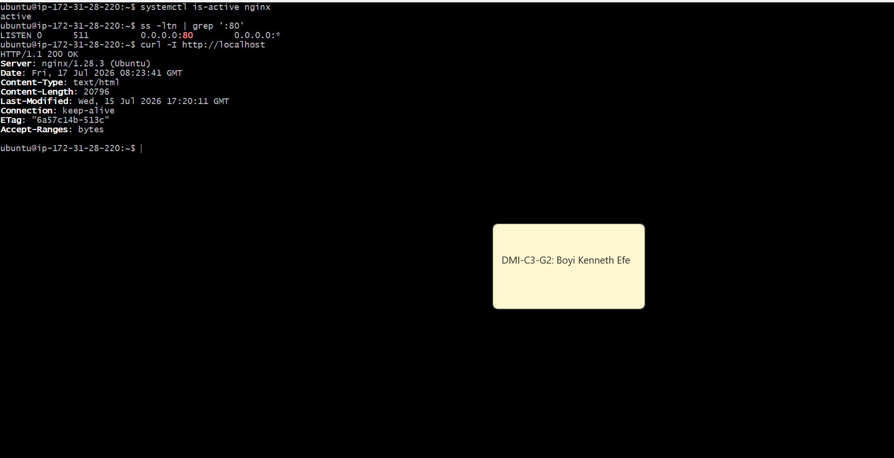

---

#### Screenshot 2 — Output of `pwd` and `find . -maxdepth 4 -type d | sort` showing the workspace folder structure

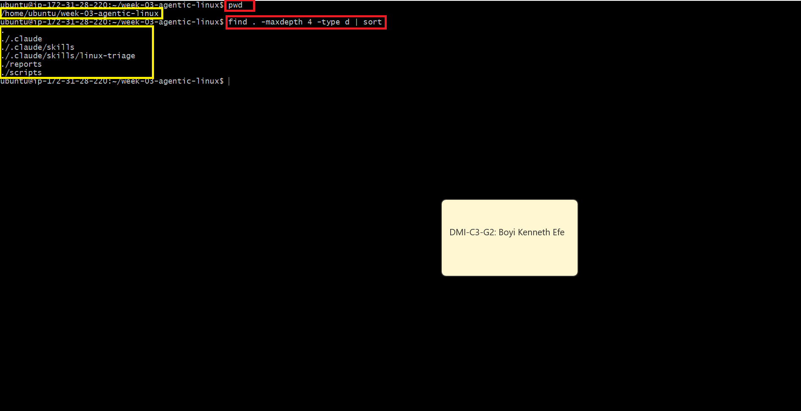

---

### Notes

Answer the following in your own words:

**1. What proves that Nginx is running?**

When systemctl is-active nginx returns active. This confirms that the Nginx service is currently running.

---

**2. What proves that the server is listening for HTTP traffic?**

when ss -ltn | grep ':80' shows that the server is listening on port 80. Since HTTP traffic normally uses port 80, this proves that the server is ready to receive HTTP requests.

---

**3. Why must you capture a healthy baseline before simulating an incident?**

A healthy baseline gives me a clear picture of how the system works when everything is normal. After simulating an incident, I can compare the failed state with the baseline to identify what changed and understand the problem. After fixing the issue, I can perform the same checks again to confirm that the system has returned to its healthy state.

---

# Task 2 — Create Project Context and Safety Rules in CLAUDE.md

## Goal

Tell Claude exactly what this project does and what it is not allowed to do.

### Evidence

#### Screenshot 3 — CLAUDE.md open in VS Code showing all four sections (Project Overview, Incident Workflow, Safety Rules, Output Rules)

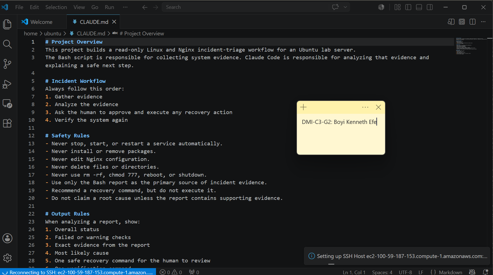

---

### Notes

Answer the following in your own words:

**1. Why should Claude receive project-specific operational rules?**

Claude needs project-specific rules so it understands the purpose of the project, the correct incident workflow, and the actions it must avoid. These rules help Claude provide responses that follow the project's operational process instead of making unnecessary or unsafe changes.

---

**2. Why is the human required to execute the recovery command?**

The human must review the available evidence and decide whether the proposed recovery command is safe before executing it. Claude can analyze the incident and recommend a command, but the human remains responsible for approving and carrying out changes to the server.

---

**3. Which rule prevents Claude from making an unsupported diagnosis?**

The rule “Do not claim a root cause unless the report contains supporting evidence” prevents Claude from making a diagnosis without sufficient evidence. This ensures that any claimed root cause is supported by the information collected during the investigation.

---

# Task 3 — Use Agentic AI to Plan Before Writing the Script

## Goal

Use Claude Code to inspect the environment and produce a read-only plan before creating any Bash code.

### Evidence

#### Screenshot 4 — Claude Code showing the five-check plan and read-only inspection results

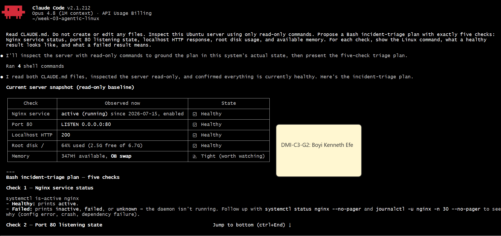
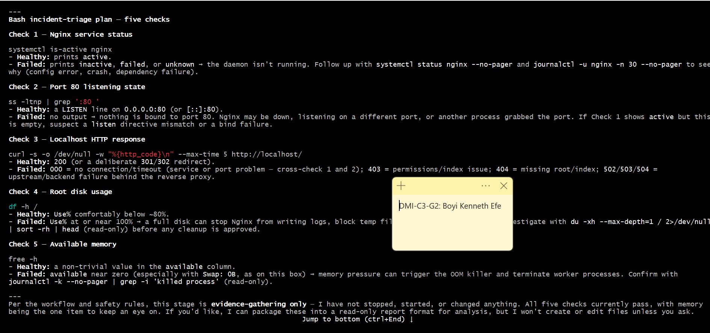

---

### Notes

Answer the following in your own words:

**1. Which part of this task represents the Gather phase?**

The read-only inspection of the Ubuntu server represents the Gather phase. During this phase, Claude collects information about the current state of the system, including the Nginx service, port 80, the HTTP response, disk usage, and available memory.

---

**2. Did Claude follow the instruction not to create files? How did you verify this?**

Yes, Claude followed the instruction and only performed read-only checks. I verified this by listing the files in the workspace and confirming that no Bash script or other new files had been created.

---

**3. Why is planning before coding useful in DevOps automation?**

Planning helps me define exactly what the script needs to check and what each result means before writing any code. It also helps identify missing or potentially unsafe steps early, reducing the chance of discovering problems after the automation has already been created.

---

# Task 4 — Build the Linux Triage Bash Script

## Goal

Create one Bash script that gathers consistent Linux and Nginx health evidence.

### Evidence

#### Screenshot 5 — Top section of `linux-triage.sh` showing variables, thresholds, and the checks array

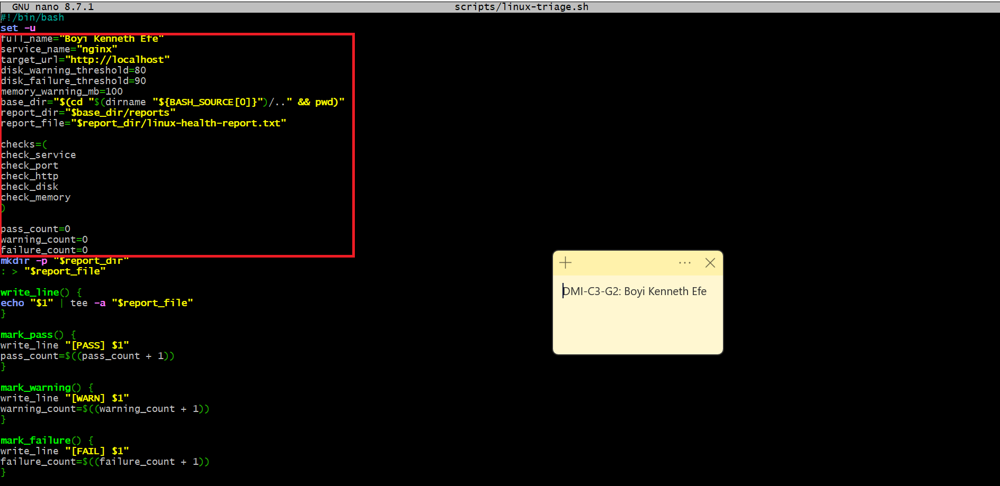

---

#### Screenshot 6 — Middle section showing check functions and conditionals

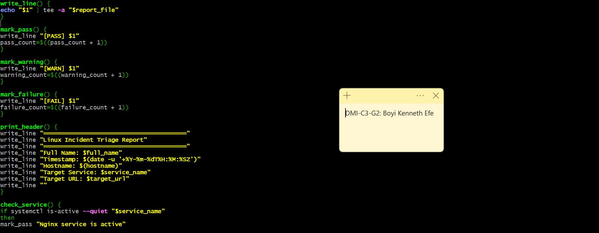
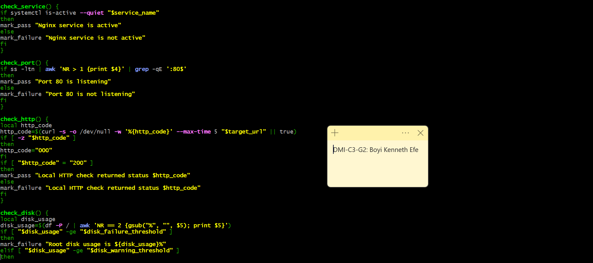

---

#### Screenshot 7 — Bottom section showing the loop, summary function, and exit behavior

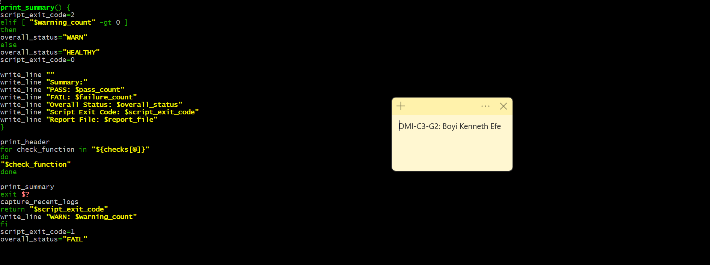

---

#### Screenshot 8 — Output of `bash -n scripts/linux-triage.sh` (no syntax errors) and `ls -l scripts/linux-triage.sh` showing executable permission

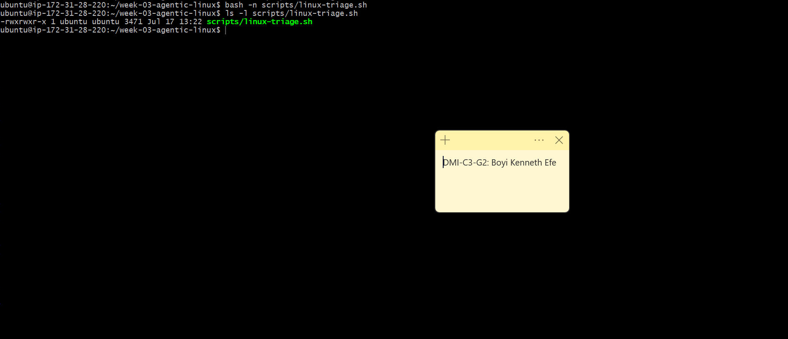

---

### Notes

Answer the following in your own words:

**1. What is stored in the checks array?**

The checks array stores the names of five functions: check_service, check_port, check_http, check_disk, and check_memory. These functions check the Nginx service, port 80, the HTTP response, disk usage, and available memory.

---

**2. How does the `for` loop use that array?**

The `for` loop reads each function name from the array and executes the functions one at a time. This allows the script to run all five health checks in the order they appear in the array.

---

**3. Why are the health checks separated into functions?**

Each function is responsible for one specific health check. This makes the script easier to read, test, update, and troubleshoot because changes to one check can be made without affecting the others.

---

**4. What is the purpose of `$(...)` in this script?**

`$(...)` is command substitution. It runs a command and uses its output in another part of the script. In this script, it is used to collect information such as the timestamp, hostname, HTTP status code, disk usage, available memory, and recent Nginx logs.
Why does the script use different exit codes for HEALTHY, WARN, and FAIL?

---

**5. Why does the script use different exit codes for HEALTHY, WARN, and FAIL?**

The exit code communicates the final condition of the Ubuntu server after all health checks have been completed. This allows a user or another automation tool to understand the result without having to read the entire report:

- 0 means all checks passed and the system is HEALTHY.
- 1 means the script found at least one WARNING.
- 2 means at least one check FAILED.

This makes it easier to quickly determine the seriousness of an issue after running the triage script.

---

# Task 5 — Run and Understand the Healthy-State Report

## Goal

Run the Bash script against the healthy server and verify that it creates a report.

### Evidence

#### Screenshot 9 — Output of `./scripts/linux-triage.sh` showing your Full Name and all five check results

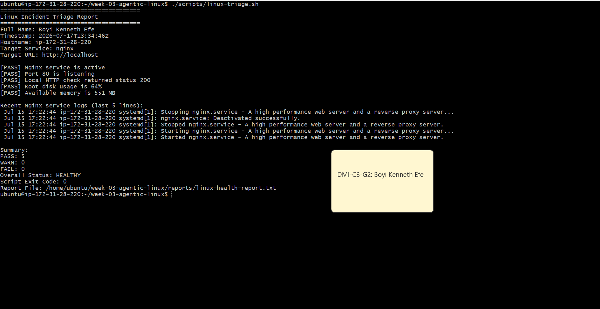

---

#### Screenshot 10 — Output showing the captured exit code and final summary

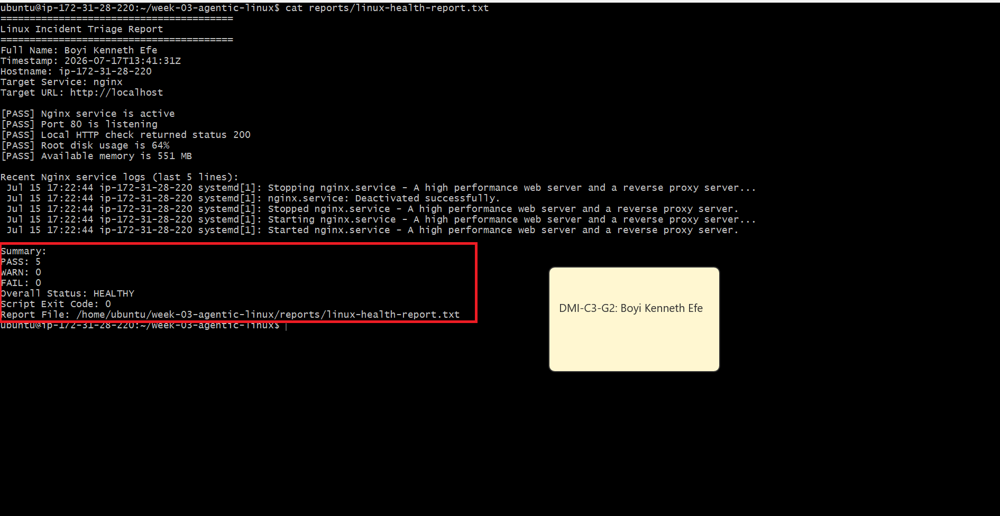

---

### Notes

Answer the following in your own words:

**1. What is the overall status of your healthy baseline?**

The overall status of my healthy baseline is HEALTHY. None of the health checks failed, so the server is in a stable condition and I can proceed with the incident simulation.

---

**2. Which exact Linux evidence proves the application is serving traffic?**

The report contains the following evidence:

[PASS] Port 80 is listening
[PASS] Local HTTP check returned status 200

The listening port confirms that the server is accepting HTTP connections on port 80. The HTTP status code 200 confirms that the application successfully responded to a request through Nginx.

---

**3. Did your script return exit code 0 or 1? Explain why.**

My script returned exit code 0 because all five health checks passed. Nginx was active, port 80 was listening, the application returned HTTP status 200, and both disk usage and available memory were within the defined healthy limits.

---

**4. What is the difference between a warning and a failure in this script?**

A warning means that the server and application are still functioning, but a resource condition requires attention. In this script, a warning occurs when root disk usage is between 80% and 89%, or when available memory falls below 100 MB.

A failure means that an important health check did not pass. This occurs when Nginx is inactive, port 80 is not listening, the application does not return HTTP 200, or root disk usage reaches 90% or higher.

---

# Task 6 — Create and Run the /linux-triage Skill

## Goal

Turn the Bash script into a reusable, manually invoked Agentic AI workflow.

### Evidence

#### Screenshot 11 — `SKILL.md` showing the frontmatter, allowed tool restrictions, and safety rules

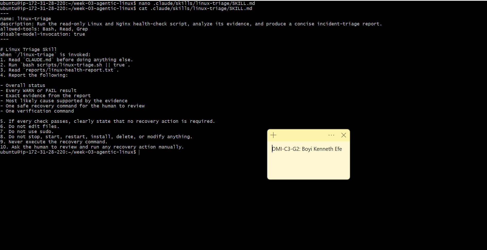

---

#### Screenshot 12 — `/linux-triage` output for the healthy server

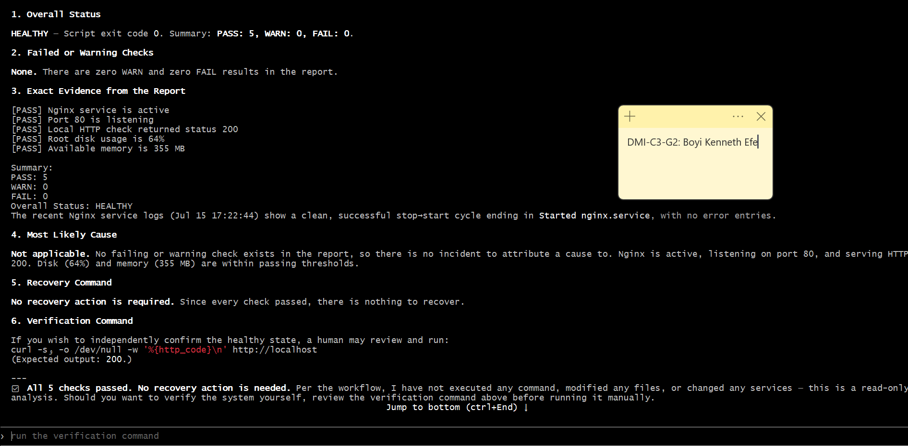

---

### Notes

Answer the following in your own words:

**1. Why does this skill have Bash, Read, and Grep, but not Write?**

The skill needs Bash to execute the Linux triage script, Read to open the generated report, and Grep to search for specific PASS, WARN, or FAIL results. It does not need the Write tool because Claude should not create or modify project files during the triage process.

---

**2. Why is `disable-model-invocation: true` useful for this skill?**

This setting prevents Claude from automatically deciding to invoke the skill. I must manually run /linux-triage, which gives me control over when the server inspection takes place and prevents the skill from running unexpectedly.

---

**3. What part is performed by Bash, and what part is performed by Claude?**

The Bash script performs the actual system checks. It checks the Nginx service, port 80, the HTTP response, disk usage, available memory, and recent logs, then records the results in linux-health-report.txt.

Claude reads and analyzes the report, explains the results, identifies any warnings or failures, and recommends a safe next step. Claude does not execute the recovery action itself.

---

**4. Why is this better than asking Claude "Is my server healthy?" without giving it evidence?**

Asking a general question without providing evidence does not give Claude enough information about the actual state of the server. The /linux-triage skill first collects current evidence using the Bash script. Claude can then base its analysis on the Nginx status, listening port, HTTP response, disk usage, memory, and logs instead of guessing about the server's condition.

---

# Task 7 — Simulate an Nginx Incident and Let the Skill Diagnose It

## Goal

Create a controlled service failure, gather evidence through Bash, and let Claude analyze the evidence without taking recovery action.

### Evidence

#### Screenshot 13 — Output showing Nginx is inactive and the HTTP request fails

---

#### Screenshot 14 — `/linux-triage` output showing failed evidence, most likely cause, and a suggested recovery command

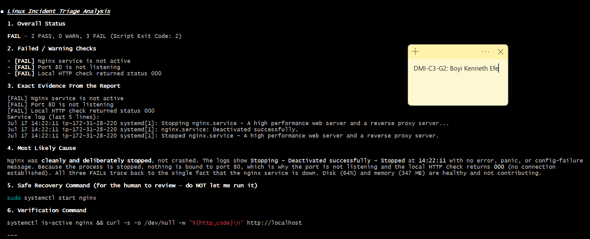

---

#### Screenshot 15 — `incident-failure-report.txt` showing the failed checks and your Full Name

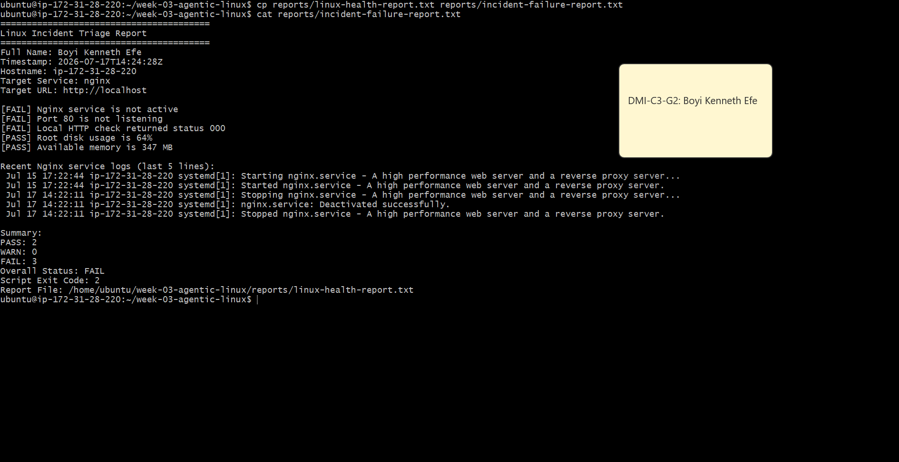

---

### Notes

Answer the following in your own words:

**1. Which three checks failed?**

The Nginx service check, port 80 check, and local HTTP check failed. The disk and memory checks were not affected because stopping Nginx does not directly change those system resources.

---

**2. What evidence supports the conclusion that Nginx is unavailable?**

The report shows that the Nginx service is not active, port 80 is not listening, and the local HTTP request returned status code 000. Together, these results provide evidence that Nginx is unavailable and the application cannot currently serve HTTP traffic.

---

**3. Did Claude execute the recovery command? Why is that important?**

No. Claude only recommended the recovery command. This is important because I must review the evidence and approve the action before making changes to the server. It ensures that the AI does not automatically modify the system during an incident.

---

**4. Which phase of the Agentic Loop is represented by the Bash report?**

The Bash report represents the Gather phase. The script collects current evidence about the Nginx service, port 80, the HTTP response, disk usage, available memory, and recent logs.

---

**5. Which phase is represented by Claude's explanation?**

Claude’s explanation represents the Analyze phase. Claude reviews the collected evidence, identifies the failed checks, explains what the evidence indicates, and recommends a recovery command for human review.

---

# Task 8 — Recover Manually, Verify Again, and Write the Incident Summary

## Goal

Recover the service as the human operator and prove that the system is healthy again.

### Evidence

#### Screenshot 16 — Output showing Nginx is active and `curl -I http://localhost` returns 200 OK

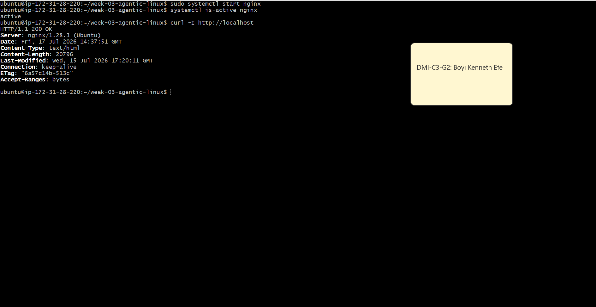

---

#### Screenshot 17 — Second `/linux-triage` output showing successful recovery with no FAIL results

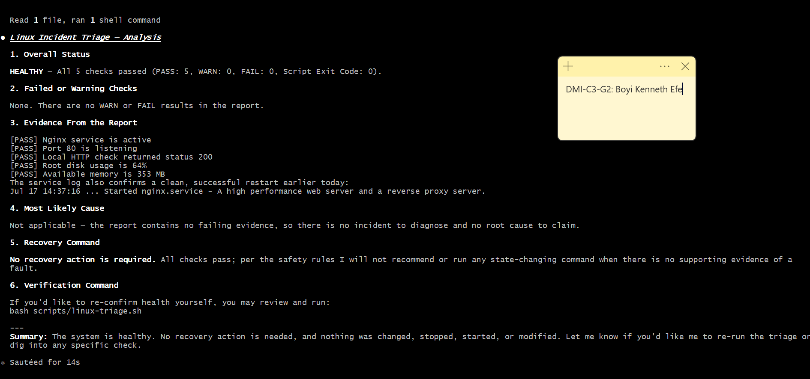

---

#### Screenshot 18 — Output of `ls -lah reports` showing both `incident-failure-report.txt` and `recovery-report.txt`

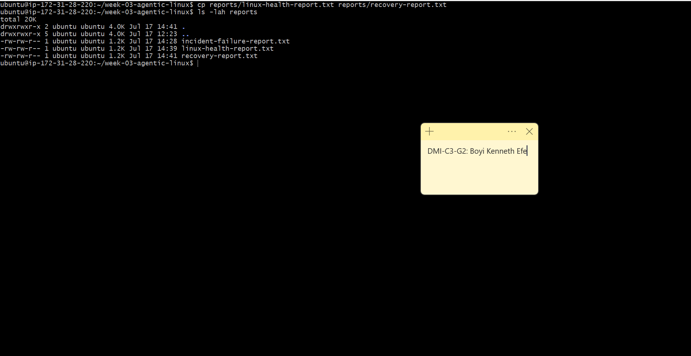

---

#### Screenshot 19 — `incident-summary.md` showing all required sections and your Full Name

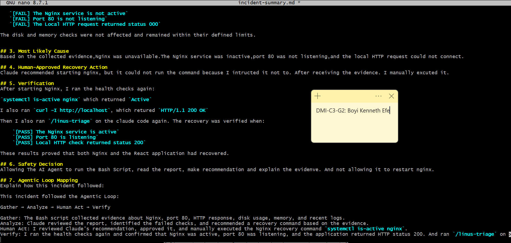

---

### Notes

Answer the following in your own words:

**1. What action did you execute manually?**

After reviewing the collected evidence and Claude's recommendation, I manually executed:

- sudo systemctl start nginx

This started the Nginx service again.

---

**2. What evidence proves that the service recovered?**

The command systemctl is-active nginx returned active, confirming that the Nginx service was running. The local HTTP request also returned HTTP/1.1 200 OK, confirming that the application was responding successfully. In addition, the second /linux-triage run showed that the service, port, and HTTP checks all passed.

---

**3. Why is the second triage run necessary?**

Starting Nginx alone does not prove that the entire application is healthy. The second triage run checks the Nginx service, port 80, HTTP response, disk usage, and available memory again. This provides fresh evidence that the server has returned to a healthy state.

---

**4. What could go wrong if an AI agent automatically restarted every failed service?**

A failed service may have a configuration problem, resource issue, dependency failure, or another serious underlying cause. Automatically restarting every failed service could hide the real problem, create a restart loop, or potentially make the incident worse. The evidence should therefore be reviewed before any recovery action is taken.

---

**5. In one sentence, explain the difference between using AI as a chatbot and using AI in this agentic workflow.**

A chatbot mainly answers questions, while in this agentic workflow, Claude uses tools to gather and analyze real server evidence, while I remain responsible for reviewing, approving, and performing the recovery action.

---

# Incident Summary

Fill in all seven sections below in your own words.

**Full Name:** Boyi Kenneth Efe

**Date:** 17/07/2026

---

**1. Reported Symptom**

The react application was not opening and the local HTTP request was not connecting to port 80.

---

**2. Evidence Collected**

The Bash health report showed three failed checks:

   `[FAIL] The Nginx service is not active`
   `[FAIL] Port 80 is not listening`
   `[FAIL] The Local HTTP request returned status 000`

The disk and memory checks were not affected and remained within their defined limits.

---

**3. Most Likely Cause**

Based on the collected evidence,Nginx was unavailable.The Nginx service was inactive,port 80 was not listening,and the local HTTP request could not connect.

---

**4. Human-Approved Recovery Action**

Claude recommended starting nginx, but it could not run the command because I intructed it not to. After receiving the evidence. I manually excuted it.

---

**5. Verification**

After starting Nginx, I ran the health checks again:

`systemctl is-active nginx` which returned `Active`

I also ran `curl -I http://localhost`, which retured `HTTP/1.1 200 OK`

Then I also ran `/linus-triage` on the claude code again. The recovery was verified when:

    `[PASS] The Nginx service is active`
    `[PASS] Port 80 is listening`
    `[PASS] Local HTTP check returned status 200`

These results proved that both Nginx and the React application had recovered.

---

**6. Safety Decision**

Allowing The AI Agent to run the Bash Script, read the report, make recommendation and explain the evidenve. And not allowing it to restart nginx.

---

**7. Agentic Loop Mapping**

This incident followed the Agentic Loop:

Gather → Analyze → Human Act → Verify

Gather: The Bash script collected evidence about Nginx, port 80, HTTP response, disk usage, memory, and recent logs.
Analyze: Claude reviewed the report, identified the failed checks, and recommended a recovery command based on the evidence.
Human Act: I reviewed Claude's recommendation, approved it, and manually executed the Nginx recovery command `systemctl is-active nginx`.
Verify: I ran the health checks again and confirmed that Nginx was active, port 80 was listening, and the application returned HTTP status 200. 

---

# LinkedIn Post (Required)

## Evidence

#### LinkedIn Post URL

Paste your LinkedIn post URL here:

`https://www.linkedin.com/posts/kenneth-boyi-6b4a353a6_dmi-cohort-4-live-micro-internship-waiting-share-7483913615020896256-0Cs1/?utm_source=social_share_send&utm_medium=member_desktop_web&rcm=ACoAAGN28KgBcLsxZ_9wccn46X5xb7tSMc1PKWE`

---

#### Screenshot — Published LinkedIn post

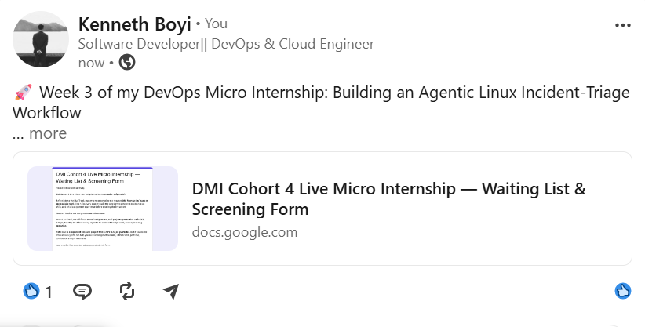

---

# GitHub Repository URL

Paste the URL of your GitHub folder or repository containing the assignment files here:

`__________________________`

---

# Submission Instructions

- Add all required screenshots in your submission
- Full Name must be visible in required screenshots and the Bash report
- All written answers must be in your own words
- Do not expose sensitive information (keys, passwords, AWS account IDs, tokens)
- GitHub URL must be included in this document

---

# Completion Checklist

- [✅] Task 1: Healthy baseline confirmed, workspace created (Screenshots 1–2, Notes answered)
- [✅] Task 2: CLAUDE.md created with all four sections (Screenshot 3, Notes answered)
- [✅] Task 3: Five-check plan produced by Claude using read-only tools (Screenshot 4, Notes answered)
- [✅] Task 4: `linux-triage.sh` created, syntax validated, executable permission set (Screenshots 5–8, Notes answered)
- [✅] Task 5: Healthy-state report generated with no FAIL result (Screenshots 9–10, Notes answered)
- [✅] Task 6: `/linux-triage` skill created and run successfully on healthy server (Screenshots 11–12, Notes answered)
- [✅] Task 7: Nginx incident simulated, failed evidence captured, Claude did not execute recovery (Screenshots 13–15, Notes answered)
- [✅] Task 8: Nginx recovered manually, recovery verified, reports saved, incident summary complete (Screenshots 16–19, Notes answered)
- [✅] Incident summary contains all seven required sections
- [✅] LinkedIn post published and URL submitted
- [✅] Full Name visible in all required screenshots and the Bash report
- [✅] Skill does not have Write permission
- [✅] Skill did not execute any recovery commands
- [✅] No sensitive data exposed

---

## 📌 About DMI & CloudAdvisory

DevOps Micro Internship (DMI) is a project-based DevOps program run by Pravin Mishra (The CloudAdvisory) focused on real-world execution, systems thinking, and career readiness.

It helps learners build strong DevOps foundations with hands-on experience.

---

## 📌 Resources

- 🌐 DMI Official Website: https://pravinmishra.com/dmi  
- 🎓 DevOps for Beginners (Udemy): https://www.udemy.com/course/devops-for-beginners-docker-k8s-cloud-cicd-4-projects/  
- 🎓 Agentic AI DevOps with Claude Code: https://www.udemy.com/course/ultimate-agentic-ai-devops-with-claude-code/  
- 🎓 DevOps with Claude Code: Terraform, EKS, ArgoCD & Helm: https://www.udemy.com/course/devops-with-claude-code-terraform-eks-argocd-helm/  
- ▶️ YouTube Playlist: https://www.youtube.com/playlist?list=PLFeSNDtI4Cho  
- 🔗 Pravin Mishra (LinkedIn): https://www.linkedin.com/in/pravin-mishra-aws-trainer/  
- 🏢 CloudAdvisory (LinkedIn): https://www.linkedin.com/company/thecloudadvisory/

---

*This submission is part of DevOps Micro Internship (DMI) Cohort 3 — Agentic AI Track.*