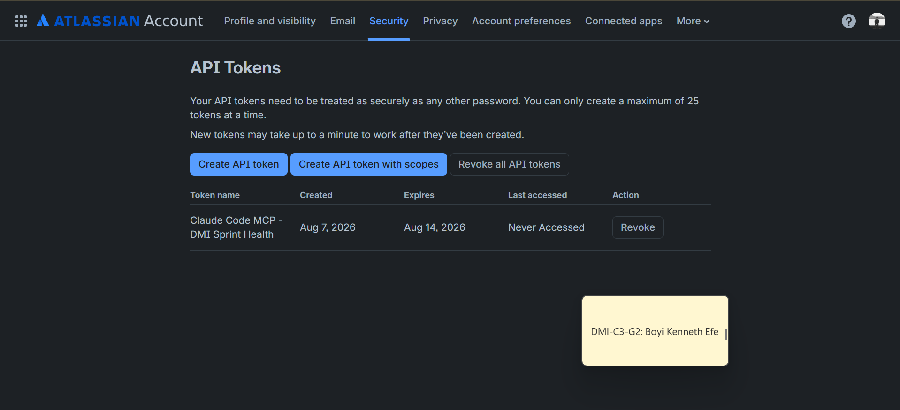
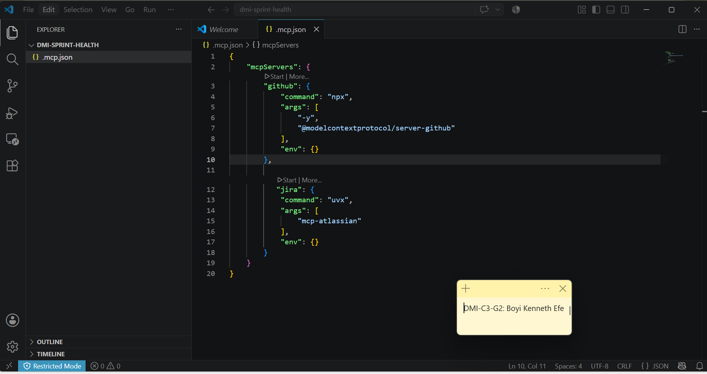
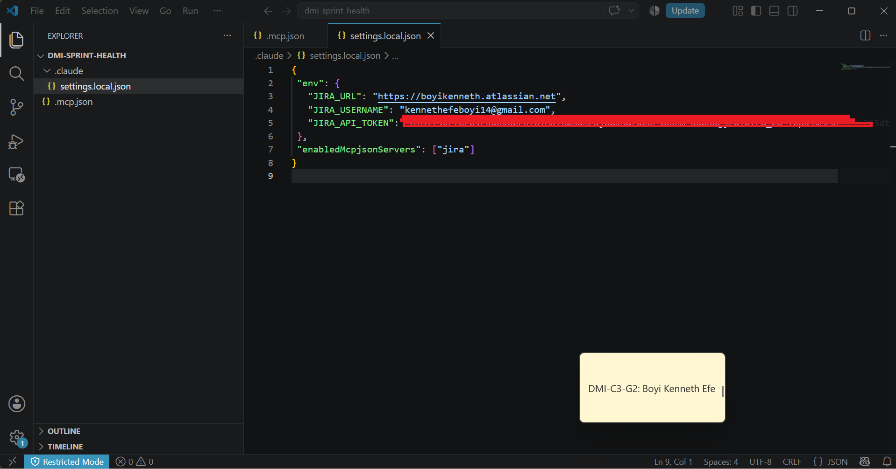
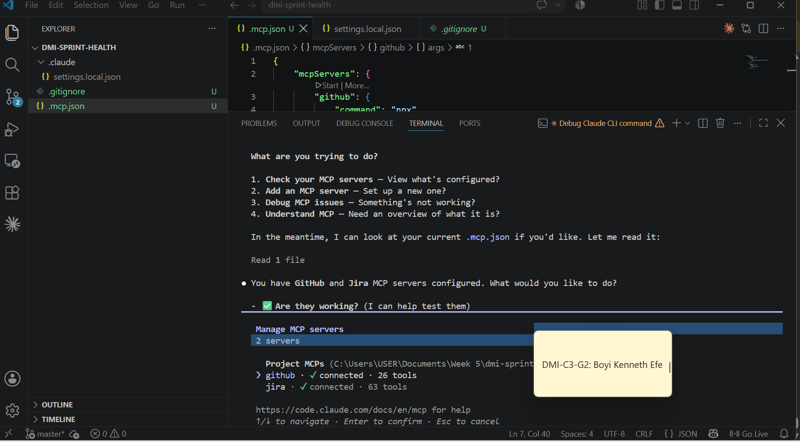
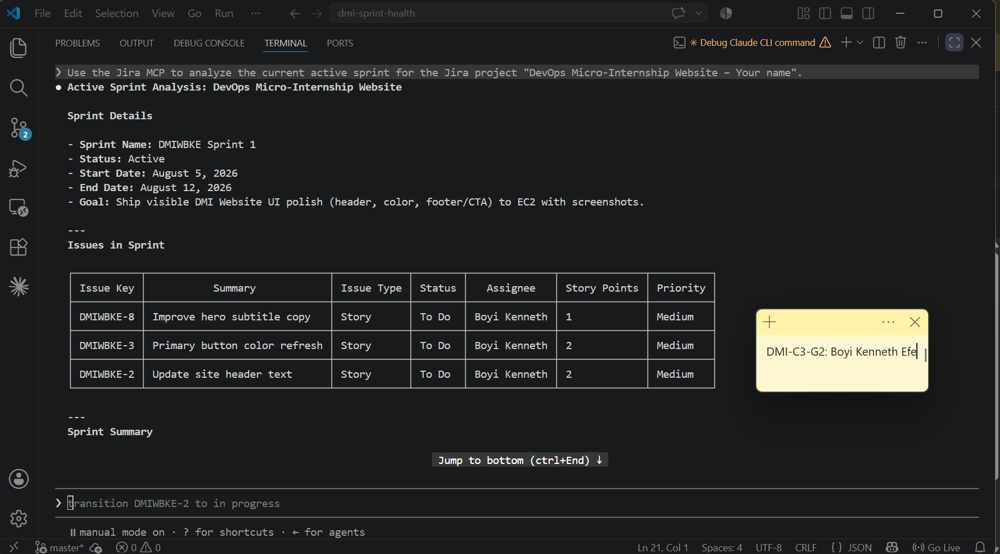
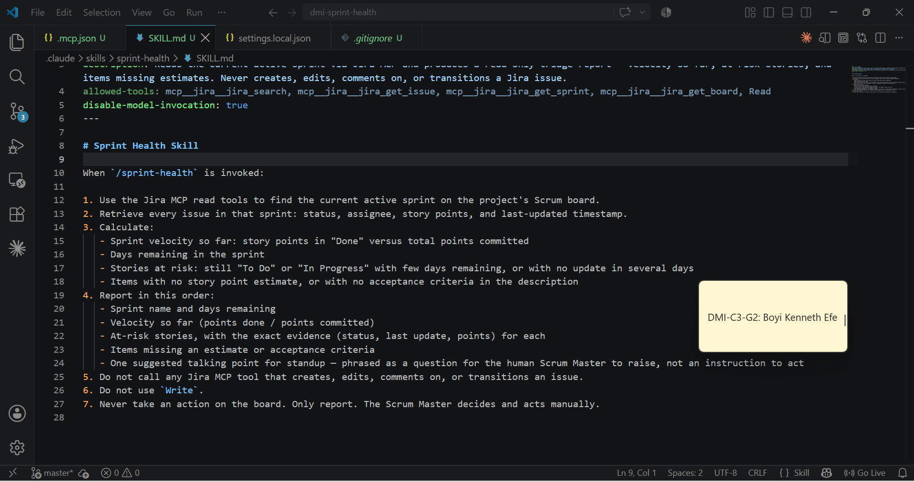
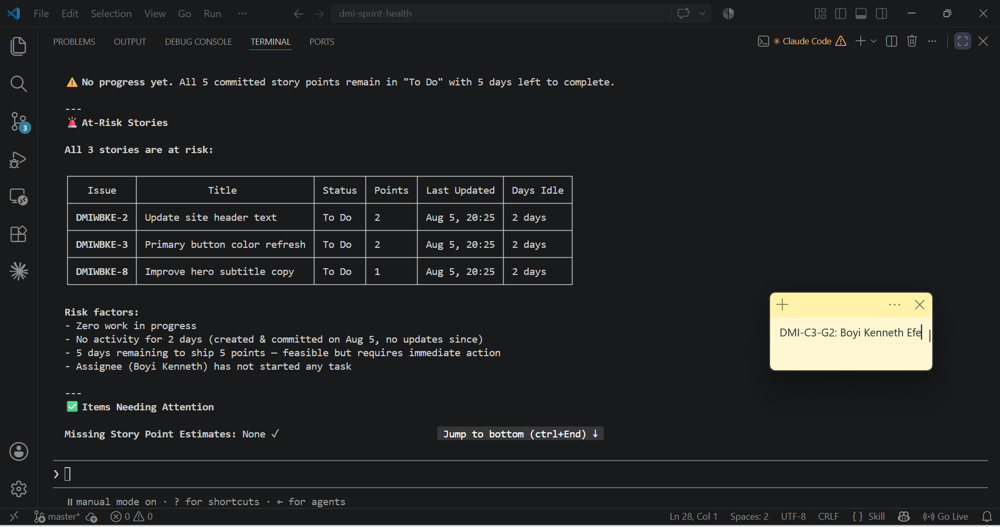
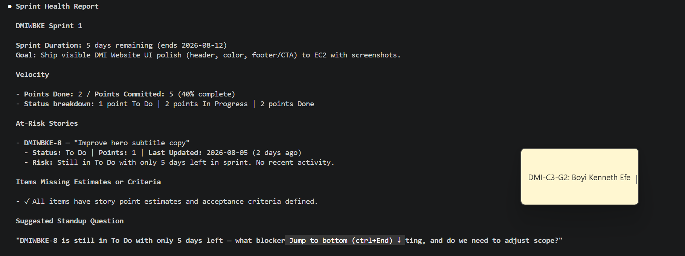

# Assignment 5 — AI-Assisted Sprint Health Report via Jira MCP

Part of the DevOps Micro Internship (DMI) Cohort 3 with Agentic AI

---

## Purpose

In this assignment, you will connect Claude Code to your Jira board through an MCP server, the same way you connected it to GitHub in Week 2, and build a read-only `/sprint-health` skill. The skill reads your current sprint through Jira's API and reports sprint velocity, stories at risk of missing the sprint, and items missing an estimate — but it must never create, edit, comment on, or transition a single ticket itself. You will prove that boundary holds by making a real change on the board yourself and confirming the skill only ever reports, never acts.

---

# Task 1 — Create a Jira API Token

## Goal

Generate an API token from your Atlassian account that the MCP server will use to authenticate with your Jira site. Do not screenshot the token value itself.

### Evidence

#### Screenshot 1 — Jira API token creation confirmation page showing the token name, with the token value not visible

### Notes You Must Write (Very Important):

Why does the MCP server need your site URL and account email in addition to the token?

 The MCP server needs the site URL, account email, and API token because each piece of information serves a different purpose. The site URL tells the server which website to connect to, the account email identifies the user or account making the request, and the API token securely authenticates that the request is authorized. Together, they ensure the MCP server connects to the correct site and performs actions securely on behalf of the right user.

---

# Task 2 — Create .mcp.json at the Project Root

## Goal

Create or update `.mcp.json` at your project root with a Jira MCP server block, following the same shape as the GitHub MCP server you configured in Week 2.

### Evidence

#### Screenshot 2 — `.mcp.json` open in VS Code showing the Jira server configuration

### Notes You Must Write (Very Important):

Compare this jira block to the github block from Week 2 Assignment 5. The GitHub server ran via npx (a Node.js package); this one runs via uvx (a Python package) — what stays exactly the same shape despite that difference, and why doesn't Claude Code care which language a given MCP server is written in?

 Although the GitHub MCP server (Week 2 Assignment 5) runs using **npx** (a Node.js package) and the Jira MCP server runs using **uvx** (a Python package), the overall MCP configuration remains the same. Both require a server definition, a command to launch the server, and any necessary arguments or environment variables. The only difference is the runtime used to start the server—**npx** for JavaScript/Node.js and **uvx** for Python.

 Claude Code does not care which programming language an MCP server is written in because it communicates using the standardized **Model Context Protocol (MCP)**. As long as the server follows the MCP specification, Claude Code can interact with it in the same way regardless of whether it was built with Node.js, Python, Go, or another language. This standard interface allows different MCP servers to be used interchangeably.

---

# Task 3 — Add Your Credentials to settings.local.json

## Goal

Add your Jira site URL, account email, and API token to `.claude/settings.local.json`, and confirm that file is listed in `.gitignore` so it is never committed.

### Evidence

#### Screenshot 3 — `settings.local.json` open in VS Code showing the `env` section, with the actual token value blurred or covered

### Notes You Must Write (Very Important):

Why must JIRA_API_TOKEN live in settings.local.json and never in .mcp.json?

 `JIRA_API_TOKEN` must live in `settings.local.json` because it is a secret credential used to authenticate my Jira account. The `settings.local.json` file is ignored by Git, so the token stays on my local machine and is never uploaded to GitHub. In contrast, `.mcp.json` is intended for shareable MCP server configuration (such as the server command, arguments, and environment variable names) and may be committed to a repository. Storing the token in `.mcp.json` could accidentally expose it to others, creating a security risk. By keeping the token in `settings.local.json`, the configuration remains portable while sensitive credentials stay private.

---

# Task 4 — Verify the Connection with /mcp

## Goal

Restart Claude Code and confirm the Jira MCP server shows as connected.

### Evidence

#### Screenshot 4 — `/mcp` output showing `jira: connected`

---

# Task 5 — Run a Live Query to Prove Real Board Data

## Goal

Ask Claude to list the issues in your current active sprint through the Jira MCP connection, and confirm the result matches what you see on your live board in the browser.

### Evidence

#### Screenshot 5 — Claude's response showing the live sprint issue list retrieved via Jira MCP

### Notes You Must Write (Very Important):

How did you confirm this was real board data and not something Claude guessed?

I confirmed it was real because the response matched my live Jira board exactly, including the active sprint, issue names, statuses, assignees, and story points. These project-specific details could be verified directly in Jira and were too specific for Claude to guess, showing that the Jira MCP server retrieved live data from the Jira REST API.

---

# Task 6 — Build the /sprint-health Skill

## Goal

Create a `/sprint-health` skill restricted to read-only Jira tools plus `Read`, with no issue-mutating tools and no `Write`. Run it and confirm it produces a report covering sprint velocity, at-risk stories, and items missing an estimate.

### Evidence

#### Screenshot 6 — `SKILL.md` frontmatter showing `allowed-tools` limited to read-only Jira tools plus `Read`, with `disable-model-invocation: true`

#### Screenshot 7 — `/sprint-health` output showing the full triage report against your real sprint

### Notes You Must Write (Very Important):

1. Which Jira MCP tools does this skill's allowed-tools list include, and which mutating tools (create issue, update issue, transition issue, add comment) does it deliberately exclude?

The skill's allowed-tools list includes read-only Jira MCP tools used to retrieve project information, such as viewing sprint details, issues, board status, and other project data. It deliberately excludes all mutating tools, including create issue, update issue, transition issue, and add comment, so the skill cannot modify the Jira project.

2. Why does a Scrum Master need this restriction more than almost any other role in this course?

A Scrum Master's primary responsibility is to inspect and monitor the team's progress, not to change project data. Restricting the skill to read-only tools prevents accidental modifications to issues, sprint status, or comments while reviewing the board. This ensures the Scrum Master can gather accurate information and report on the project's state without affecting the team's work, preserving transparency and the integrity of the Jira board.

---

# Task 7 — Prove the Skill Never Mutates the Board

## Goal

Manually update one ticket on your board in the browser (for example, move a story to "Done" or add a missing estimate), then run `/sprint-health` again and confirm the new report reflects your change — proving the skill only ever reads live state and never wrote to the board itself.

### Evidence

#### Screenshot 8 — Second `/sprint-health` run showing the report now reflects your manual board change

### Notes You Must Write (Very Important):

Map this assignment to Gather → Analyze → Human Act → Verify from Week 3 Assignment 6. Which step did you perform manually in the browser, and why must that step stay human?

- Gather: The Jira MCP server gathered live data from my Jira project using the Jira REST API.

- Analyze: Claude analyzed the retrieved sprint, issues, statuses, assignees, and story points, then presented them in a readable summary.

- Human Act: I manually reviewed the Jira board and authenticated the MCP server in the browser. This step must remain human because it involves logging into my account, granting permissions, and confirming that the returned information matches the live Jira board. These actions require human judgment and approval for security reasons.

- Verify: I compared Claude's output with the actual Jira board to confirm that the sprint details, issues, and statuses matched exactly, verifying that the data came from the live project rather than being generated.✅
---

# Submission Instructions

Complete all tasks in sequence.

Your submission must include:
- All 8 required screenshots
- All the required notes

---

# Completion Checklist

- [✅] Task 1: Jira API token created, value never screenshotted (Screenshot 1)
- [✅] Task 2: `.mcp.json` has the Jira server block (Screenshot 2)
- [✅] Task 3: Credentials stored in `settings.local.json`, token blurred, file gitignored (Screenshot 3)
- [✅] Task 4: `/mcp` shows the Jira server connected (Screenshot 4)
- [✅] Task 5: Live query returned real sprint data, verified against the browser (Screenshot 5)
- [✅] Task 6: `/sprint-health` skill created with correct read-only `allowed-tools`, and produced a full report (Screenshots 6–7)
- [✅] Task 7: A manual board change was reflected in a second `/sprint-health` run (Screenshot 8)
- [✅] Skill never created, edited, transitioned, or commented on any issue
- [✅] Reflection answered (Notes)
- [✅] No API token value exposed

---

## 📌 About DMI & CloudAdvisory

DevOps Micro Internship (DMI) is a project-based DevOps program run by Pravin Mishra (The CloudAdvisory) focused on real-world execution, systems thinking, and career readiness.

It helps learners build strong DevOps foundations with hands-on experience.

---

## 📌 Resources

- 🌐 DMI Official Website: https://dmi.pravinmishra.com?utm_source=github&utm_medium=readme  
- 🎓 University: https://university.pravinmishra.com?utm_source=github&utm_medium=readme  
- 💬 Discord Community: https://discord.pravinmishra.com?utm_source=github&utm_medium=readme  
- 📝 Blog: https://dmi.pravinmishra.com/blog?utm_source=github&utm_medium=readme  
- ▶️ YouTube Playlist: https://www.youtube.com/playlist?list=PLFeSNDtI4Cho  
- 🔗 Pravin Mishra (LinkedIn): https://www.linkedin.com/in/pravin-mishra-aws-trainer/  
- 🏢 CloudAdvisory (LinkedIn): https://www.linkedin.com/company/thecloudadvisory/

---

*This submission is part of DevOps Micro Internship (DMI) Cohort 3 — Agentic AI Track.*
