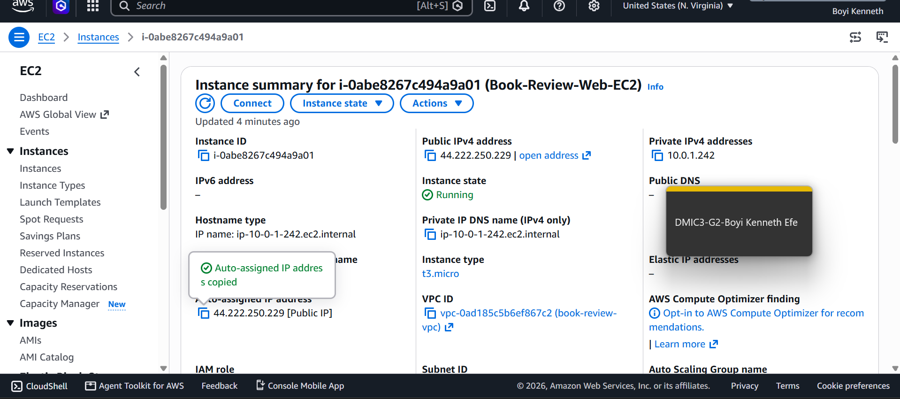
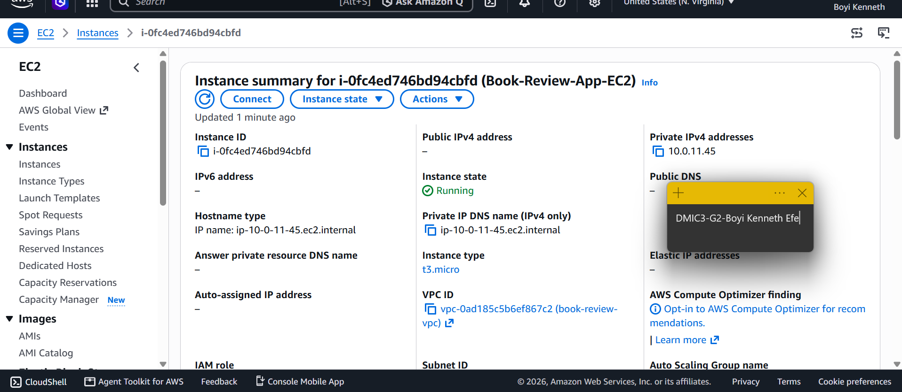
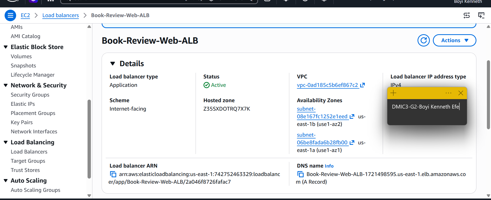
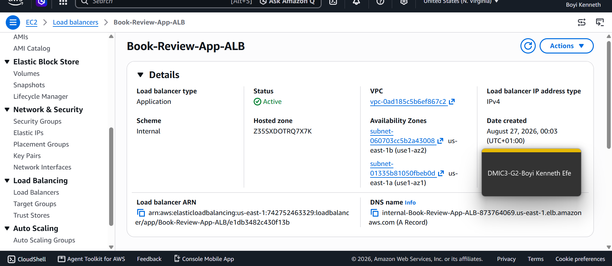
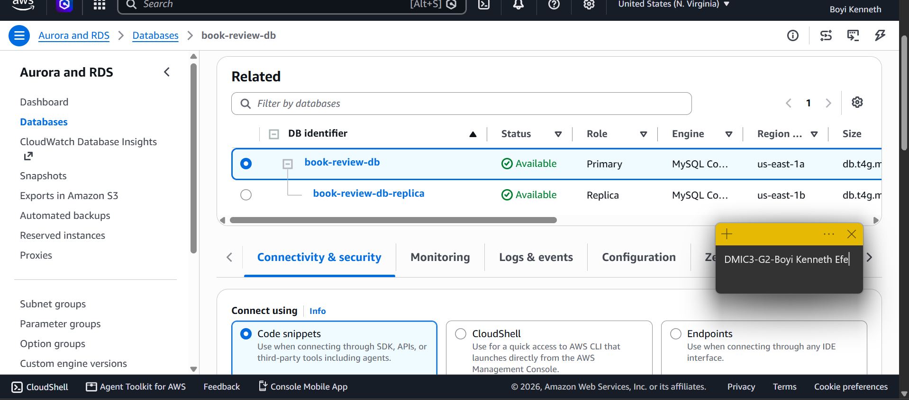
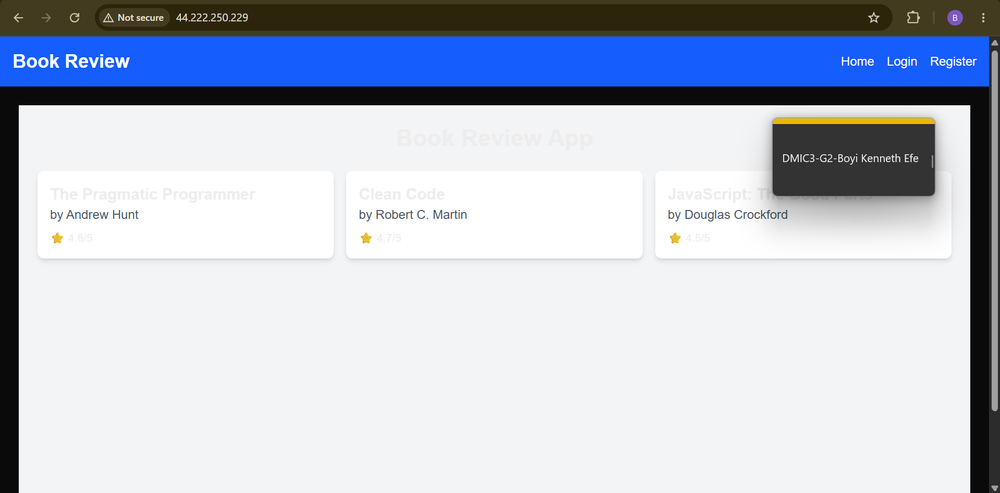
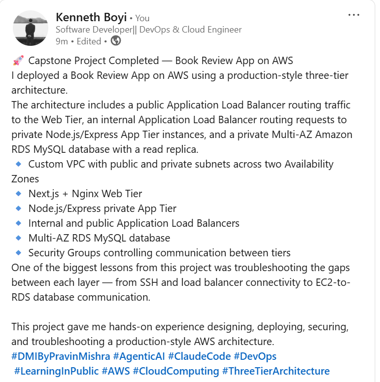

# Assignment 6 — Capstone: Deploy Book Review App (Three-Tier Architecture) on AWS

Part of the DevOps Micro Internship (DMI) Cohort 3 with Agentic AI

---

## Purpose

This is the most important assignment of the course. You will deploy the Book Review App in a fully production-style three-tier architecture on AWS: a Next.js Web Tier behind Nginx and a public ALB, a private Node.js/Express App Tier behind an internal ALB, and a private Multi-AZ MySQL RDS database with a read replica. You are expected to design, deploy, isolate, debug, and document the result independently.

---

# Task 1 — Architecture Diagram

## Goal

Create an architecture diagram showing the custom VPC (10.0.0.0/16), the six subnets across two Availability Zones (two public Web Tier, two private App Tier, two private Database Tier), the public ALB, Web Tier EC2/Nginx, internal ALB, private App Tier EC2, private Multi-AZ RDS with its read replica, and the permitted traffic flow.

### Evidence

#### Diagram image or link

Add your diagram image or link here.

---

# Task 2 — AWS Region & Services Used

## Goal

Record the AWS Region used and list every AWS service used across networking, compute, load balancing, security, and the database.

### Notes

**Region:**

us-east-1 (N. Virginia)

---

**Services used:**

Amazon VPC
Amazon EC2
Application Load Balancer (ALB)
Amazon RDS for MySQL
Amazon CloudWatch
AWS IAM
Internet Gateway
NAT Gateway
Security Groups
Network ACLs
Route Tables
Availability Zones

---

# Task 3 — Public Entry Point

## Goal

Confirm the Book Review App loads through the public ALB DNS name.

### Evidence

#### Public ALB DNS

Paste your public ALB DNS name here:

`Book-Review-Web-ALB-1721498595.us-east-1.elb.amazonaws.com`

---

# Task 4 — Evidence Screenshots

## Goal

Capture visual proof of every tier and load balancer.

### Evidence

#### Screenshot 1 — Web Tier EC2 instance in a public subnet

---

#### Screenshot 2 — App Tier EC2 instance in a private subnet

---

#### Screenshot 3 — Public Application Load Balancer configuration or healthy targets

---

#### Screenshot 4 — Internal Application Load Balancer configuration or healthy targets

---

#### Screenshot 5 — Amazon RDS for MySQL showing Multi-AZ and the read replica

---

#### Screenshot 6 — Book Review App UI working through the public ALB

---

# Task 5 — Summary

## Goal

Summarize what worked in the final deployment, the issues encountered and how each was fixed, and the tools or sources used to research and debug.

### Notes

**What worked:**

The Book Review App was deployed on AWS using a three-tier architecture. The Web Tier uses Next.js and Nginx on EC2 instances in public subnets behind a public Application Load Balancer. The App Tier uses Node.js/Express on private EC2 instances behind an internal Application Load Balancer. The database tier uses Amazon RDS for MySQL in private subnets with Multi-AZ configuration and a read replica.

The public Application Load Balancer provides the main entry point to the application, while the private App Tier and database are isolated from direct public access. Security groups were configured to restrict communication between the different tiers.

---

**Issues encountered and fixes:**

Several deployment and connectivity issues were encountered during the deployment.

SSH connectivity issue: SSH initially timed out when connecting to the EC2 public IP. The EC2 instance, public IP address, security group, and network configuration were checked to identify the connectivity problem.

Frontend/backend connectivity: The frontend was successfully served through the public IP and Nginx, but the backend process was not running. PM2 was checked and the correct frontend process name was identified as frontend.

Database connectivity: The backend .env file was initially configured with DB_HOST=localhost and DB_USER=root, which was incorrect for the AWS RDS deployment. Connectivity testing from the EC2 instance to the RDS endpoint on port 3306 resulted in a timeout, indicating that the RDS security group/network access still needed to be corrected.

Application showing no books: The application loaded successfully but displayed "No books available." Investigation of the backend source code showed that the application uses Sequelize with MySQL and automatically creates sample books when the Books table is empty. This indicated that the backend/database connection needed to be resolved before the application could retrieve and display the books.

PM2 process name: An attempt to restart a process named web-tier failed because no PM2 process with that name existed. Running pm2 list showed that the actual process name was frontend, so the correct command is pm2 restart frontend.

---

**Tools/sources used:**

The deployment and troubleshooting process used the AWS Management Console, EC2, Amazon VPC, Application Load Balancer, Amazon RDS, Linux command-line tools, SSH, Nginx, PM2, Node.js, npm, MySQL, Sequelize, Git/GitHub, and browser-based application testing.

Linux commands such as ssh, ls, grep, find, ps, ss, and nc were used to inspect the application, processes, ports, and network connectivity. AWS documentation and application documentation were used as references during configuration and troubleshooting.

---

# LinkedIn Post (Required)

## Goal

Publish a LinkedIn post sharing the capstone deployment, including the public ALB DNS (or a redacted screenshot), three to five lines on what you built and why it is production-style, and one proof screenshot.

## Evidence

#### LinkedIn Post URL

Paste your LinkedIn post URL here:

`https://lnkd.in/p/ejrtfvM6`

---

#### Screenshot — Published LinkedIn post

---

# Submission Instructions

- Add all required screenshots and links in your submission
- Do not expose passwords, RDS credentials, connection strings, private keys, or account IDs

---

# Completion Checklist

- [✅] Task 1: Architecture diagram completed
- [✅] Task 2: AWS Region and services documented
- [✅] Task 3: Public ALB DNS confirmed working
- [✅] Task 4: All six evidence screenshots captured (Web Tier, App Tier, both ALBs, RDS + replica, app UI)
- [✅] Task 5: Deployment summary completed (what worked, issues/fixes, tools/sources)
- [✅] LinkedIn post published and URL submitted
- [✅] App Tier and Database Tier confirmed not publicly accessible
- [✅] No sensitive data exposed

---

## 📌 About DMI & CloudAdvisory

DevOps Micro Internship (DMI) is a project-based DevOps program run by Pravin Mishra (The CloudAdvisory) focused on real-world execution, systems thinking, and career readiness.

It helps learners build strong DevOps foundations with hands-on experience.

---

## 📌 Resources

- 🌐 DMI Official Website: https://dmi.pravinmishra.com?utm_source=github&utm_medium=readme  
- 🎓 University: https://university.pravinmishra.com?utm_source=github&utm_medium=readme  
- 💬 Discord Community: https://discord.pravinmishra.com?utm_source=github&utm_medium=readme  
- 📝 Blog: https://dmi.pravinmishra.com/blog?utm_source=github&utm_medium=readme  
- ▶️ YouTube Playlist: https://www.youtube.com/playlist?list=PLFeSNDtI4Cho  
- 🔗 Pravin Mishra (LinkedIn): https://www.linkedin.com/in/pravin-mishra-aws-trainer/  
- 🏢 CloudAdvisory (LinkedIn): https://www.linkedin.com/company/thecloudadvisory/

---

*This submission is part of DevOps Micro Internship (DMI) Cohort 3 — Agentic AI Track.*
