# Assignment 5 — Production-Grade EpicBook: Terraform + Ansible Roles (Azure or AWS)

Part of the DevOps Micro Internship (DMI) Cohort 3 with Agentic AI

---

## Purpose

In this assignment, you will deploy the EpicBook web application on a cloud VM provisioned with Terraform (Azure or AWS — pick one) and configured through reusable Ansible roles (`common`, `nginx`, `epicbook`) orchestrated by one playbook, using group variables, templates, and handlers, with a verified idempotent second run.

---

# Task 1 — Set Up Folder Layout

## Goal

Create the `epicbook-prod` project with `terraform/azure` or `terraform/aws`, `ansible/inventory.ini`, `ansible/site.yml`, `ansible/group_vars/web.yml`, and the `common`, `nginx`, and `epicbook` role directories.

### Evidence

#### Screenshot 1 — Terminal or editor showing the complete `epicbook-prod` project tree

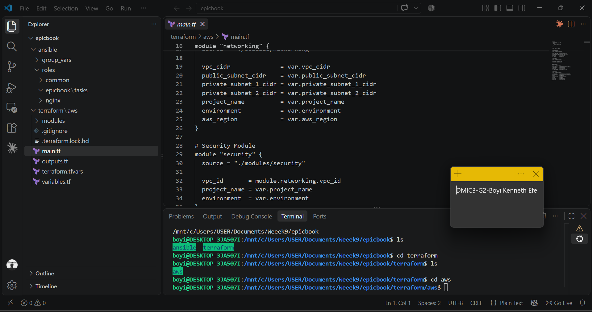

---

# Task 2 — Terraform (Pick One: Azure or AWS)

## Goal

Provision one secure Ubuntu 22.04 VM with SSH key authentication, inbound SSH (22) and HTTP (80), and `public_ip`/`admin_user` outputs, on your chosen cloud.

### Evidence

#### Screenshot 2 — Terminal showing successful `terraform apply` and `terraform output` with `public_ip` and `admin_user`

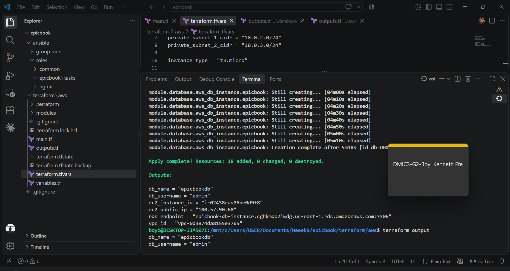

---

#### Screenshot 3 — Terraform code or cloud console showing inbound rules for ports 22 and 80

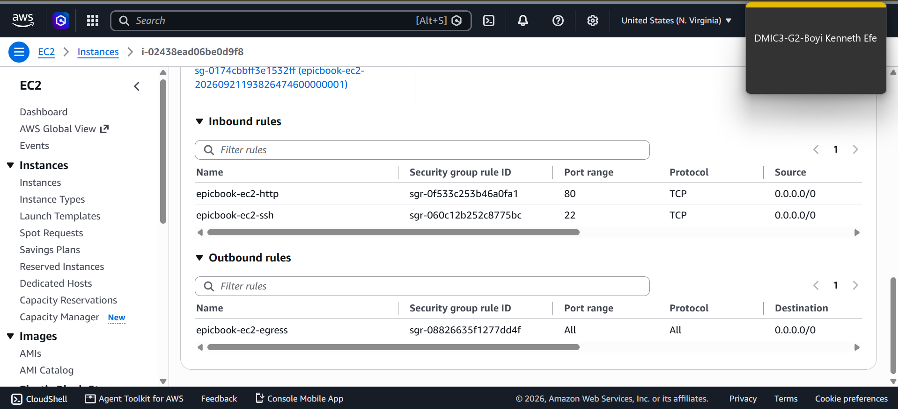

---

# Task 3 — Ansible Inventory

## Goal

Create the `[web]` inventory using the Terraform `public_ip` and `admin_user` outputs, and verify passwordless SSH and `ansible ping`.

### Evidence

#### Screenshot 4 — Terminal showing the successful passwordless SSH hostname check

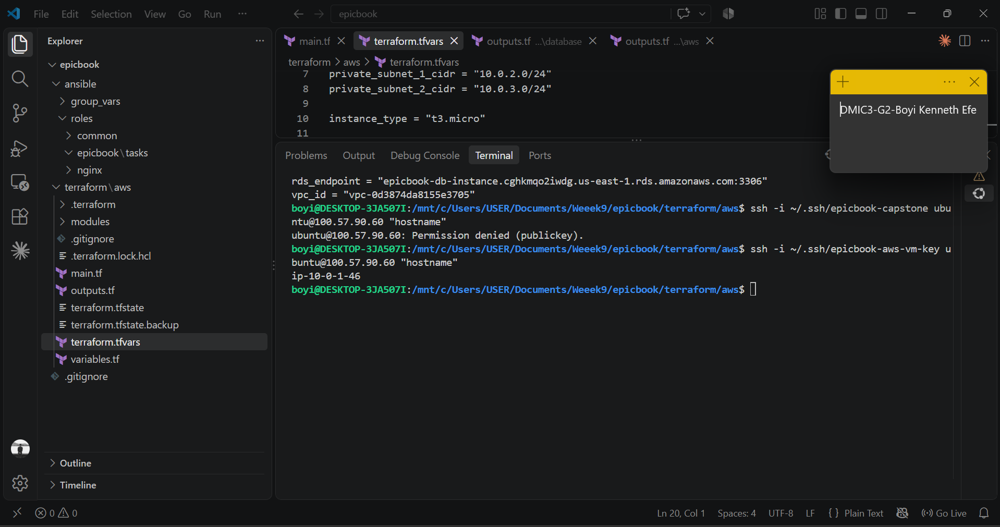

---

#### Screenshot 5 — Editor or terminal showing `inventory.ini` and a successful Ansible ping

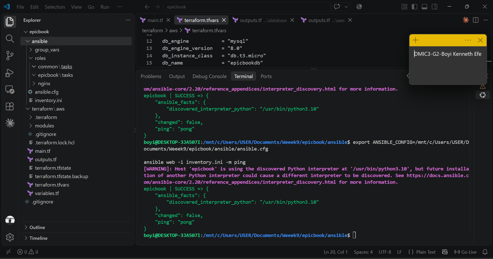

---

# Task 4 — Create site.yml (Role Orchestration)

## Goal

Create `site.yml` invoking the `common`, `nginx`, and `epicbook` roles in that exact order.

### Evidence

#### Screenshot 6 — Editor showing `ansible/site.yml` with the three roles in the required order

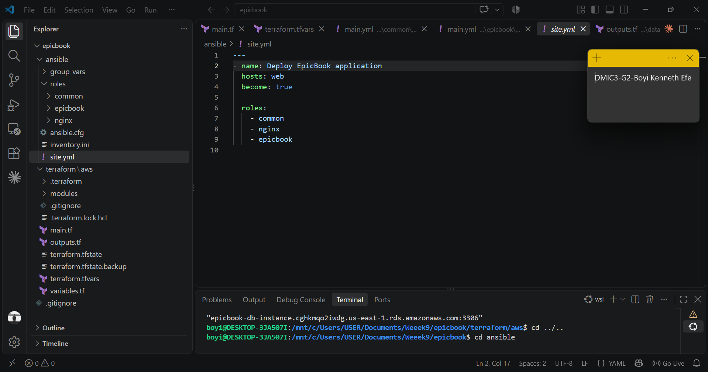

---

# Task 5 — Role: common

## Goal

Create `roles/common/tasks/main.yml` to update apt, upgrade packages, install baseline packages (`git`, `curl`, `unzip`, `software-properties-common`), with optional SSH hardening applied only after key-based access is confirmed.

### Evidence

#### Screenshot 7 — Editor showing `roles/common/tasks/main.yml`

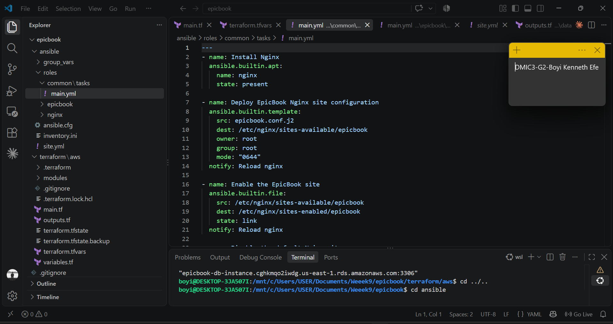

---

# Task 6 — Role: nginx

## Goal

Create the `nginx` role to install Nginx, deploy the `epicbook.conf.j2` template to `/etc/nginx/sites-available/epicbook`, enable the site, remove the default site, and reload via handler.

### Evidence

#### Screenshot 8 — Editor showing the Nginx role tasks, handler, and `epicbook.conf.j2` template

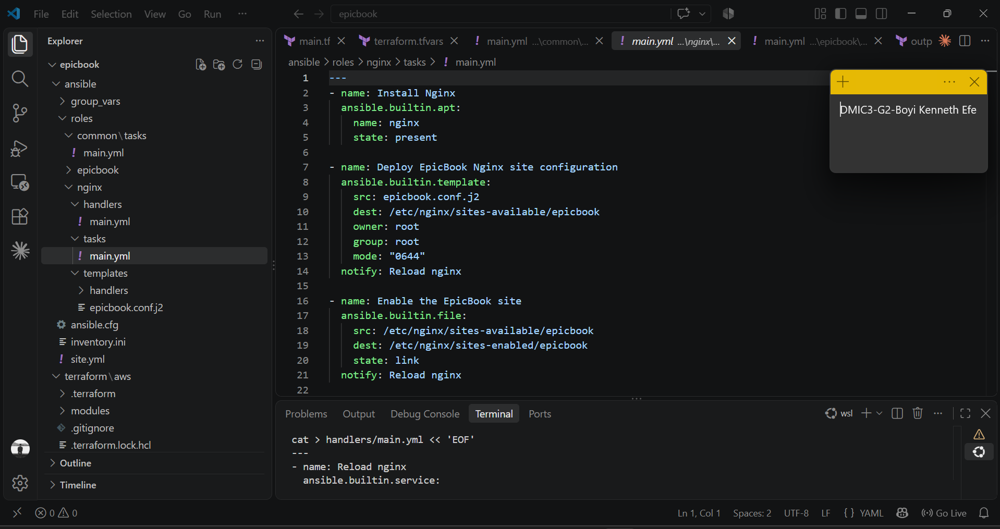

---

#### Screenshot 9 — Terminal showing `/etc/nginx/sites-available/epicbook` and a successful Nginx configuration test

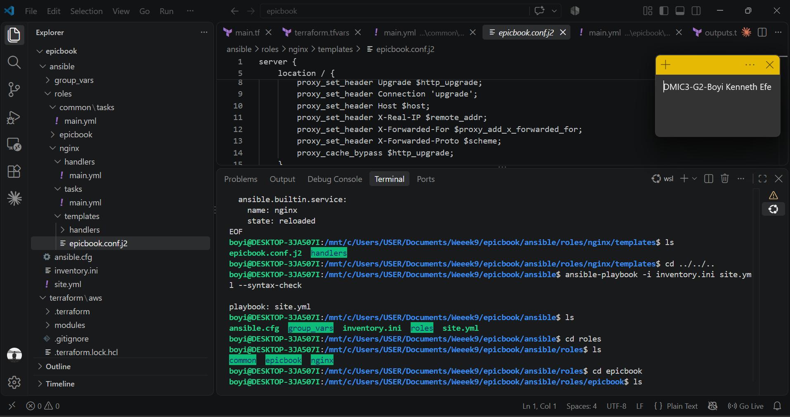

---

# Task 7 — Role: epicbook

## Goal

Create the `epicbook` role to clone the repository to `{{ app_dest }}`, set ownership/permissions using group variables, and notify the Nginx reload handler on change.

### Evidence

#### Screenshot 10 — Editor showing `roles/epicbook/tasks/main.yml`

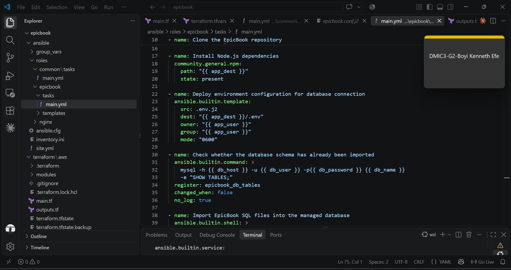

---

# Task 8 — Group Variables

## Goal

Define `app_repo`, `app_dest`, `app_user`, and `app_group` in `ansible/group_vars/web.yml`.

### Evidence

#### Screenshot 11 — Editor showing `ansible/group_vars/web.yml`

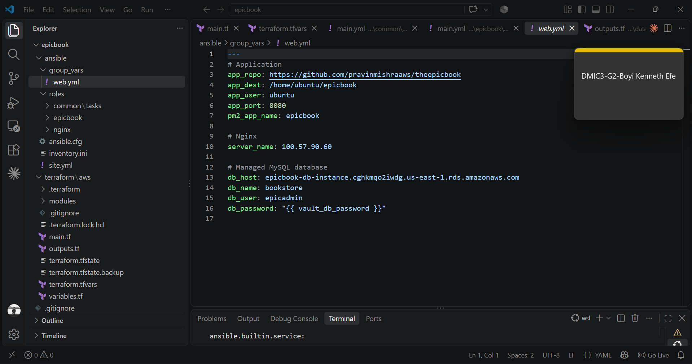

---

# Task 9 — Run the Playbook

## Goal

Run `ansible-playbook -i inventory.ini site.yml` and confirm `common` → `nginx` → `epicbook` all complete with `failed=0`.

### Evidence

#### Screenshot 12 — Terminal showing the role-based Ansible run and final recap with `failed=0`

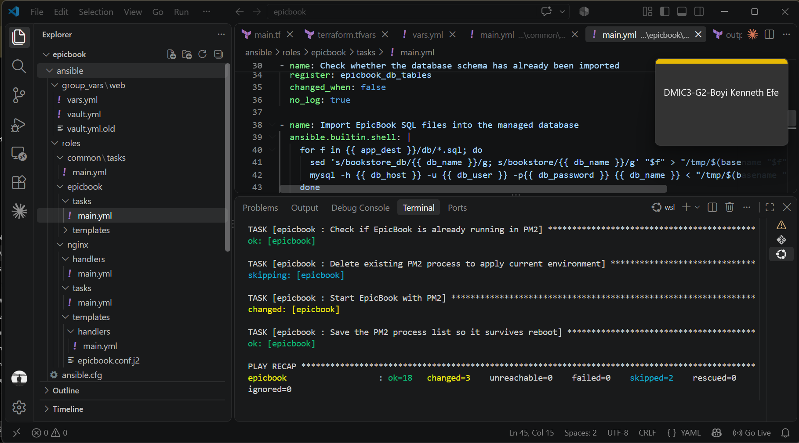

---

# Task 10 — Verify

## Goal

Confirm the EpicBook site loads with HTTP 200, inspect the Nginx configuration, and rerun the playbook to confirm the second run is mostly OK/UNCHANGED with `failed=0`.

### Evidence

#### Screenshot 13 — Browser showing the EpicBook site with the public IP visible

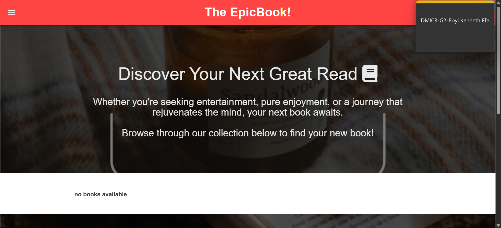

---

#### Screenshot 14 — Terminal showing HTTP 200 and the Nginx site-file snippet

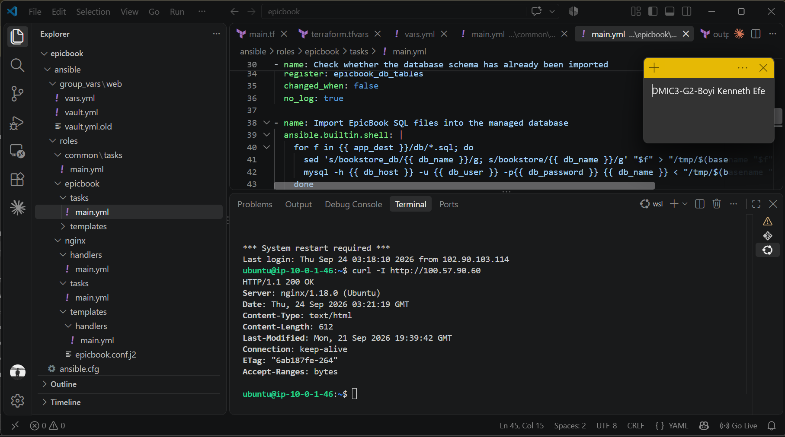

---

#### Screenshot 15 — Terminal showing the idempotent second Ansible run with mostly OK/UNCHANGED and `failed=0`

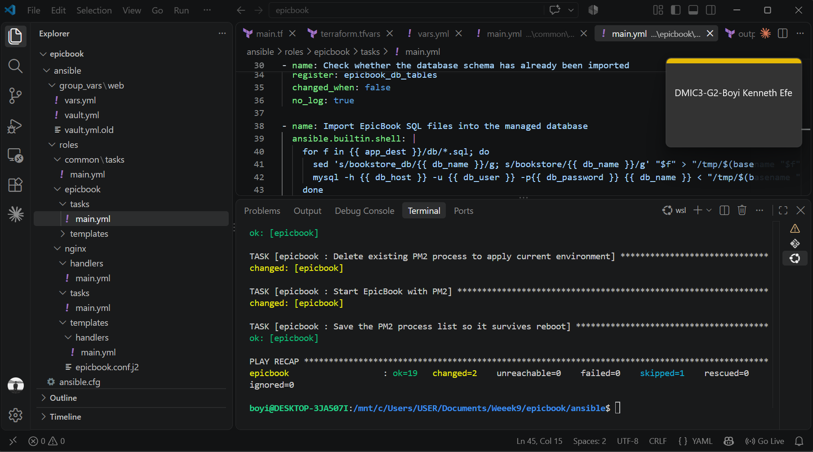

---

### Notes

Describe an issue you faced and how you fixed it, what you learned, any security issues you identified, and your production remediation plan.

During the EpicBook deployment, I faced an issue where Nginx was displaying the default welcome page instead of the application. I traced the problem by checking the Nginx configuration and the application port. The EpicBook Node.js application was running on port 8080, but Nginx had not reloaded the updated reverse-proxy configuration. After validating the configuration with `nginx -t` and reloading Nginx, traffic was correctly forwarded from port 80 to the EpicBook application on port 8080.

I also encountered a database import issue because the SQL files contained hard-coded `bookstore` database references while my AWS RDS database was named `epicbookdb`. I fixed this by transforming those references during the Ansible import process so the SQL files could be imported into the managed RDS database.

I learned how Terraform can provision the underlying AWS infrastructure while Ansible handles operating-system configuration, application deployment, Nginx configuration, database initialization, and process management with PM2. I also learned the importance of testing each layer independently before troubleshooting the complete application stack.

Security issues identified included database credentials being required during deployment, SSH access to the EC2 instance, and the need to ensure that the RDS database is not publicly accessible. The RDS instance was configured as private, while SSH access should be restricted to trusted administrator IP addresses rather than being broadly exposed.

For production remediation, I would store database credentials in AWS Secrets Manager or AWS Systems Manager Parameter Store instead of relying on manually managed secrets. I would also restrict security-group rules to the minimum required ports and trusted sources, use HTTPS with an SSL/TLS certificate, enable database backups and encryption, apply least-privilege IAM permissions, and add monitoring and centralized logging. I would also use a production deployment pipeline with automated security scanning and controlled infrastructure changes.

---

# LinkedIn Post (Required)

## Goal

Publish a LinkedIn post describing the Terraform + Ansible roles deployment (cloud chosen, role structure, Nginx deployment, idempotency result), and add a 4–6 line video reflection covering one challenge/fix, security issues observed, and your production remediation plan.

## Evidence

#### LinkedIn Post URL

Paste your LinkedIn post URL here:

`https://lnkd.in/p/eBarnUYG`

---

#### Screenshot — Published LinkedIn post

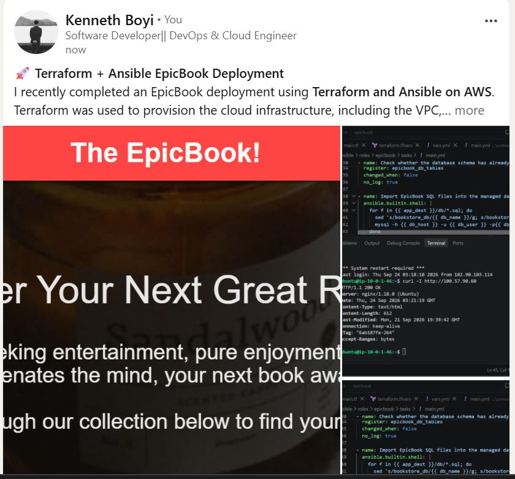

---

#### Video reflection screenshot

---

# Submission Instructions

- Add all required screenshots in your submission
- Do not expose private keys, credentials, tokens, or unrestricted management access

---

# Completion Checklist

- [ ] Task 1: `epicbook-prod` project and role structure created (Screenshot 1)
- [ ] Task 2: Cloud VM provisioned with Terraform (Screenshots 2–3)
- [ ] Task 3: Passwordless SSH and Ansible ping verified (Screenshots 4–5)
- [ ] Task 4: `site.yml` orchestrates roles in common → nginx → epicbook order (Screenshot 6)
- [ ] Task 5: `common` role created (Screenshot 7)
- [ ] Task 6: `nginx` role, template, and handler created (Screenshots 8–9)
- [ ] Task 7: `epicbook` role created (Screenshot 10)
- [ ] Task 8: Group variables defined (Screenshot 11)
- [ ] Task 9: Playbook run successfully with `failed=0` (Screenshot 12)
- [ ] Task 10: Site verified and idempotent rerun confirmed (Screenshots 13–15)
- [ ] Reflection and security remediation notes written (Notes)
- [ ] LinkedIn post and video reflection submitted
- [ ] No sensitive data exposed

---

## 📌 About DMI & CloudAdvisory

DevOps Micro Internship (DMI) is a project-based DevOps program run by Pravin Mishra (The CloudAdvisory) focused on real-world execution, systems thinking, and career readiness.

It helps learners build strong DevOps foundations with hands-on experience.

---

## 📌 Resources

- 🌐 DMI Official Website: https://dmi.pravinmishra.com?utm_source=github&utm_medium=readme  
- 🎓 University: https://university.pravinmishra.com?utm_source=github&utm_medium=readme  
- 💬 Discord Community: https://discord.pravinmishra.com?utm_source=github&utm_medium=readme  
- 📝 Blog: https://dmi.pravinmishra.com/blog?utm_source=github&utm_medium=readme  
- ▶️ YouTube Playlist: https://www.youtube.com/playlist?list=PLFeSNDtI4Cho  
- 🔗 Pravin Mishra (LinkedIn): https://www.linkedin.com/in/pravin-mishra-aws-trainer/  
- 🏢 CloudAdvisory (LinkedIn): https://www.linkedin.com/company/thecloudadvisory/

---

*This submission is part of DevOps Micro Internship (DMI) Cohort 3 — Agentic AI Track.*
